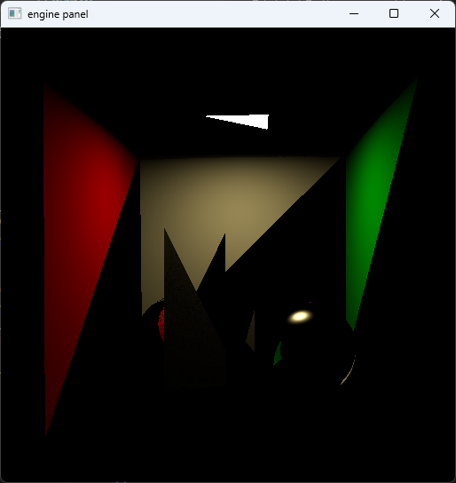
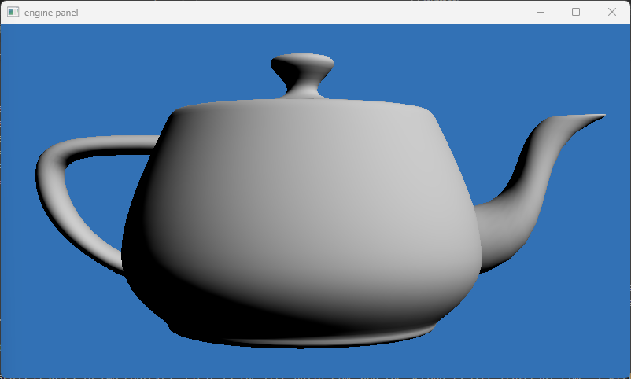
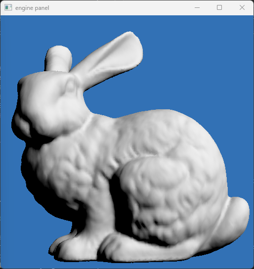
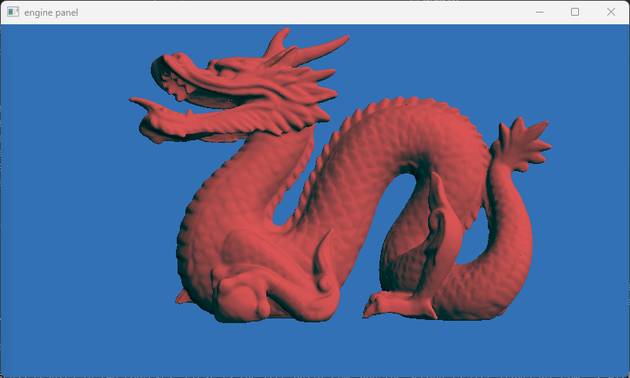
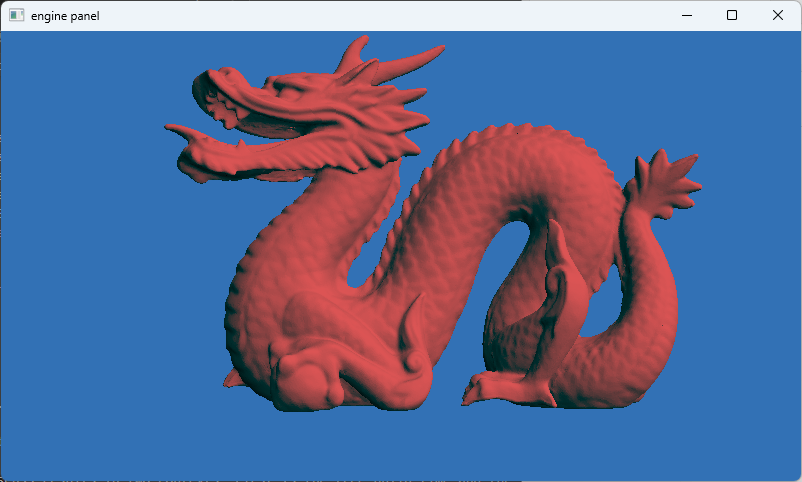

# Bounding Volume Hierarchy

## 1. Introduction

A Bounding Volume Hierarchy is a data structure for accelerating ray tracing. The main goal we have is to have linear build times and strictly sublinear traversal times in terms of the number of primitives in our structure. Fast BVH construction and traversal alongside hardware accelerated ray-triangle and ray-bounding box intersection are what made real time ray tracing possible. 

The implementation of the BVH in this project is based heavily on the Hierarchical Linear BVH (HLBVH) described in the 4th edition of the PBR book @@PBR:6 . Unfortunately, being pressed for time, I was unable to implement anything fancier or implement all of the optimizations described in the PBR book however what is here should still be quite enough.

First, I will describe the general implementation of the BVH in the project and how it differs from the PBR book. Then I will go through the implementation in detail where I describe parts of the code. Afterwards, I will provide with some performance metrics for the BVH both in terms of build times as well as traversal times before concluding with a discussion on what I have learned during this project.

In addition to the HLBVH, I also implemented another BVH based on the naive \\(O(n^3)\\) optimal split algorithm. This was mainly done as a warmup and a way to quickly check the correctness of the traversal algorithm. The implementation of that BVH will not be described in this report. There is also no point in discussing performance relating to it as any BVH of a mesh with more than a few hundred triangle takes an eternity to build.

## 2. Methodology

A Bounding Volume Hierarchy is a tree structure where each node has a key in the form of a bounding box which is the smallest bounding box that contains all of the child nodes. The leaf nodes contain the one or more primitives. We can use this structure for ray triangle intersection in complex scenes by performing a ray-bounding box intersection and then going down the tree if we get a hit. In practice, binary trees and axis aligned bounding boxes are most commonly used. Since the number of primitives allowed in leaf nodes can have dramatic effects on tree size and traversal, usually more than 1 primitives are contained in leaf nodes.

The problem with naively built BVHs is that building them takes polynomial time in the number of primitives which often makes them unusable for complex scenes with millions of primitives. However, by sacrificing tree-quality it is possible to speed up the building process.

An important observation is that any node and its children forms a complete BVH by itself. So if we can cluster primitives that we know should go to the same subtree, we can greatly speed up the process of generating a BVH by solving many small subproblems, and then we can build a complete tree from them.

This piece of the puzzle is solved by Morton encoding and Radix sort. Morton encoding assigns a similar Morton code to primitives that are geometrically close to each other. Radix sort gives a way to sort a set of numbers within a finite range in linear time to the size of the set, it can also be parallelized. We will see that the overall process is actually linear time.

The implementation works as follows.

Building:

- Generate Morton codes for each primitive
- Radix sort primitives in parallel
- Place sorted primitives in buckets based on the MSB of their Morton code and create a "Treelet" for each bucket
- Create an individual subtree for each treelet, also create a sorted array of primitive indices for the GPU
- Create a final tree using the treelets as leaf nodes
- Flatten the tree to a single array for the GPU

Traversal:

- Check ray intersection with the bounding box of the current node
    - If we collide:
        - If a leaf node, check triangle intersection with the primitives
        - Else add leaf nodes to the stack
    - Pop from the stack

The details are covered in the following section.

## 3. Implementation

I always like to think of the data structure before the implementation. As it turns out the required data structures are very similar to the BSP tree. There is not much interesting on the top level however:

```rs
/// Bounding Volume Hierarchy type
#[derive(Debug)]
pub struct Bvh {
    /// root node of the BVH
    root: BvhBuildNode,
    /// sorted array of primitives, we need to have primitives in the leaf
    /// nodes next to one another so we only have to store the pointer offset
    /// and number of elements, so we need a second storage buffer on the GPU
    /// that contains the actual indices we want to access
    primitives: Vec<AccObj>,
    // total number of nodes in the BVH
    total_nodes: u32,
}
```

One of these fields `total_nodes` for example is only used to avoid having to resize an array during the final step. The nodes themselves are more interesting.

```rs
/// Node type
#[derive(Debug, Clone)]
pub struct BvhBuildNode {
    pub bbox: Bbox,
    node_type: BvhBuildNodeType,
}

/// BVH Nodes are either a leaf or internal
#[derive(Debug, Clone)]
enum BvhBuildNodeType {
    /// We are managing that primitives belonging to a
    /// leaf node are adjacent externally 
    Leaf {
        num_primitives: u32,
        first_prim_offset: u32,
    },
    /// Interior nodes have ownership over child nodes
    Interior {
        _split: Split,
        left: Box<BvhBuildNode>,
        right: Box<BvhBuildNode>,
    },
}
```

Unlike the BSP tree, we have the bounding box of every node stored, and leaf nodes do not store the primitives directly but merely an offset, a good choice for performance. On the flip side, different from the PBR book implementation, interior nodes do have ownership over their child nodes, a bad choice for performance as it means two small heap allocations every time we create an interior node. PBR book uses a custom allocator to avoid this, unfortunately bump or arena allocators for Rust are either single threaded only or are really unergonomic to use in multithreaded contexts, the alternative would be to use something like a `Arc<Vec<OnceLock<BvhBuildNode>>>` (one time write only build node, inside a vector, inside a shared pointer) but it requires knowing the total number of nodes in advance. 

The PBR book implementation also uses split information to speed up traversal by visiting fewer nodes, I was not able to implement this functionality.

### 3.1 Construction

The first step is Morton Code generation. The process is as follows.

- Generate a bounding box of the entire scene using the center point of the bounding box of every primitive.
- Find the relative position of every center point in the scene relative to the bounding box, this will be in the [0.0, 1.0] range.
- Multiply the point by 1024 to convert and convert to fixed point coordinates.
- Use bitshifts to generate Morton codes.

None of this is parallelized.

Create the bounding box of every center point. `Bbox::include_vertex` runs in constant time, so this is linear:

```rs
        // calculate the overall boundary for morton code generation
        let mut bound = Bbox::new();
        for bbox in &primitives {
            bound.include_vertex(bbox.bbox.center());
        }
```

And:

```rs
        // generate morton codes for the primitives
        // use 30 bit morton codes as described in the PBR book
        let morton_bits = 10;
        let morton_scale = 1 << morton_bits;

        // The idea is that we convert each primitive to a single coordinate between (0, 0, 0) and (1, 1, 1)
        // relative to the overall boundary of the object. Using 32-bit floats, we only need 10-bits of fixed
        // precision to represent this range, but this will degrade quality on very large scenes
        let mut morton_primitives: Vec<MortonPrimitive> = (0..primitives.len()).into_par_iter().map(|idx| {
            let offset = bound.offset(primitives[idx].bbox.center()) * morton_scale;
            MortonPrimitive {
                index: idx as u32,
                morton_code: encode_morton_3(offset.0, offset.1, offset.2),
            }
        }).collect();
```

All operations here also run in linear time. `encode_morton_3` is straight out of the PBR book and unless using a different Morton code (perhaps a different size), there was nothing to change with it.

```rs
/// From the PBR Book vol. 4
/// https://www.pbr-book.org/4ed/Utilities/Mathematical_Infrastructure#x7-MortonIndexing
/// Take a 10-bit number and tile it as follows:
/// xyzw -> --x--y--z--w
#[inline]
fn left_shift_3(mut x: u32) -> u32 {
    if x == 1 << 10 {
        x -= 1;
    }
    x = (x | (x << 16)) & 0b00000011000000000000000011111111;
    x = (x | (x << 8)) & 0b00000011000000001111000000001111;
    x = (x | (x << 4)) & 0b00000011000011000011000011000011;
    x = (x | (x << 2)) & 0b00001001001001001001001001001001;
    x
}

#[inline]
fn encode_morton_3(x: f32, y: f32, z: f32) -> u32 {
    (left_shift_3(z as u32) << 2) | (left_shift_3(y as u32) << 1) | left_shift_3(x as u32)
}
```

After this, we are ready to sort the primitives.

For Radix Sort, I used the `rdst` crate, which seems to have the best ergonomics. There are two downsides, one is that we use 32-bits to sort while the PBR book uses 30. Second, `rdst` seems to rely on Rust's well defined unsigned integer underflow behavior that panics on debug builds (but works perfectly on release builds). I took the easy way out and do a nlogn sort in debug builds:

```rs
        // Sort primitives using morton codes
        if cfg!(debug_assertions) {
            morton_primitives.sort_unstable();
        } else {
            // It appears that the rdst crate relies on well defined unsigned underflow behavior that panics
            // on Rust debug builds, since I can't do much about this without editing that crate's source
            // code, I am just going to put this behind the release flag since it does work in that case
            morton_primitives.radix_sort_unstable();
        }
```

As it turns out, even the nlogn sort is fast enough for the Stanford Dragon.

Time to put the primitives into buckets. In the PBR book, they simply put primitives that had the same 12 MSB in their Morton codes in the same bucket. Which is also the case here. There is no real reason to create a separate data type for Treelets as they are just internal nodes themselves, so we only save what we need to, which is the range information. We also give each treelet a wide-pointer to write its ordered primitive indices to. 

```rs
        // allocate and initialize the sorted primitive array
        let mut ordered_primitives = vec![AccObj::new(0, Bbox::new()); primitives.len()];

        // Initialize treelets by pooling primitives that have the same most significant 12-bits
        // in their morton code
        let mut treelets_to_build: Vec<(usize, usize, &mut [AccObj])> = vec![];
        let mask = 0b0011_1111_1111_1100_0000_0000_0000_0000u32;
        let mut start = 0;
        let mut end = 1;
        let mut slice = ordered_primitives.as_mut_slice();
        while end <= morton_primitives.len() {
            if end == morton_primitives.len()
                || ((morton_primitives[start].morton_code & mask)
                    != (morton_primitives[end].morton_code & mask))
            {
                let num_primitives = end - start;
                let (current_slice, slice_next) = slice.split_at_mut(num_primitives);
                slice = slice_next;
                treelets_to_build.push((start, num_primitives, current_slice));
                start = end;
            }
            end += 1;
        }
```

All of the operations here are constant time except for the vector push which can cause a resize but that still ends up being amortized linear time over the loop.

Time for the complicated part, generating subtrees. Rayon is used for the actual parallelization. Since I already preallocate a buffer for every subtree to write to, it means the `emit_lbvh` function unlike the PBR book implementation requires no synchronization whatsoever. Heap allocations are synchronized at the OS level of course, but we will get there. We have a single atomic variable to sum up the number of nodes used later for a small performance optimization.

```rs
        // Create subtrees from treelets in parallel.
        let total_nodes = AtomicU32::new(0);
        let treelets: Vec<BvhBuildNode> = treelets_to_build
            .par_iter_mut()
            .map(|treelet| {
                let mut nodes_created = 0;
                let first_bit_index = 29 - 12;
                let node = emit_lbvh(
                    &primitives,
                    &morton_primitives,
                    treelet.0, // start_index
                    treelet.1, // number_of_primitives
                    &mut nodes_created,
                    treelet.2, // ordered_primitives_slice
                    first_bit_index,
                    max_prims as usize,
                );
                total_nodes.fetch_add(nodes_created, Ordering::Relaxed);
                node
            })
            .collect();
```

That is a lot of code. First, we have non-tail recursion. We are essentially trying to find bit indices in the Morton code where we have fewer than the `max_prims_in_node` number of elements (or have hit the LSB). When we find that, we calculate the bounding box and copy the primitive indexes to our ordered_primitives slice.

```rs
/// Create an LBVH subtree 
fn emit_lbvh(
    primitives: &[AccObj],
    morton_primitives: &[MortonPrimitive],
    morton_offset: usize,
    num_primitives: usize,
    total_nodes: &mut u32,
    ordered_primitives: &mut [AccObj],
    bit_index: i32,
    max_prims_in_node: usize,
) -> BvhBuildNode {
    // We cannot go further down or have few enough primitives to create a leaf
    if bit_index <= -1 || num_primitives < max_prims_in_node {
        let mut bbox = Bbox::new();
        let first_prim_offset = morton_offset;
        for i in 0..num_primitives {
            let primitive_index = morton_primitives[morton_offset + i].index;
            ordered_primitives[i] = primitives[primitive_index as usize];

            bbox.include_bbox(&primitives[primitive_index as usize].bbox);
        }

        *total_nodes += 1;
        BvhBuildNode::new_leaf(first_prim_offset as u32, num_primitives as u32, bbox)
```

First we check if we can even perform a cut on the current bit_index. 

```rs
    } else {
        let mask = 1 << bit_index;
        if (morton_primitives[morton_offset].morton_code & mask)
            == (morton_primitives[morton_offset + num_primitives - 1].morton_code & mask)
        {
            // same call with bit index dropped by 1
            emit_lbvh(
                primitives,
                morton_primitives,
                morton_offset,
                num_primitives,
                total_nodes,
                ordered_primitives,
                bit_index - 1,
                max_prims_in_node,
            )
        }
```

Otherwise we find a split using binary search.

```rs
            // find LBVH split using binary search
            let pred = |i: usize| {
                (morton_primitives[morton_offset].morton_code & mask)
                    == (morton_primitives[morton_offset + i].morton_code & mask)
            };

            let mut size_maybe = num_primitives.checked_sub(2);
            let mut first = 1;
            while size_maybe.is_some_and(|size| size > 0) {
                let size = size_maybe.unwrap();
                let half = size >> 1;
                let middle = first + half;
                let result = pred(middle);
                first = if result { middle + 1 } else { first };
                size_maybe = if result {
                    size.checked_sub(half + 1)
                } else {
                    Some(half)
                };
            }
            let offset = usize::clamp(first, 0, num_primitives.checked_sub(2).unwrap_or(0));
            let new_morton_offset = morton_offset + offset;
```

Once we determine a split, we perform the recursion and keep doing this until we reach the leaf nodes.

```rs
            let (left_ordered_primitives, right_ordered_primitives) =
                ordered_primitives.split_at_mut(offset);

            let axis = (bit_index % 3) as u32;

            // return interior LBVH node
            BvhBuildNode::new_internal(
                axis.into(),
                emit_lbvh(
                    primitives,
                    morton_primitives,
                    morton_offset,
                    offset,
                    total_nodes,
                    left_ordered_primitives,
                    bit_index - 1,
                    max_prims_in_node,
                ),
                emit_lbvh(
                    primitives,
                    morton_primitives,
                    new_morton_offset,
                    num_primitives - offset,
                    total_nodes,
                    right_ordered_primitives,
                    bit_index - 1,
                    max_prims_in_node,
                ),
            )
```

After all the treelets are generated, they have to be combined into a single tree. The method that the PBR book favors is the SAH or surface area heuristic, which I did not implement (although it would likely be the next step).

```rs
        // Use SAH or some other method to collapse nodes into a single BVH
        let mut total_nodes = total_nodes.fetch_add(0, Ordering::Relaxed);
        let root = build_upper_tree(treelets, &mut total_nodes, &mut ordered_primitives);
```

The method I used was the significantly simpler "split at half the elements" method that results in considerably lower quality trees (although as we will soon see, even this is enough to beat the BSP tree in the course).

```rs
#[inline]
fn build_upper_tree(
    build_nodes: Vec<BvhBuildNode>,
    total_nodes: &mut u32,
    _ordered_prims: &mut [AccObj],
) -> BvhBuildNode {
    // Just a wrapper for the actual implementation
    collapse_build_nodes_recursive(build_nodes, total_nodes)
}

/// Split in half implementation
fn collapse_build_nodes_recursive(
    mut build_nodes: Vec<BvhBuildNode>,
    total_nodes: &mut u32,
) -> BvhBuildNode {
    // create leaf
    if build_nodes.len() == 1 {
        build_nodes.pop().unwrap()
    } else {
        *total_nodes += 1;
        // create split using center
        let mut centroid_bound = Bbox::new();
        for node in build_nodes.iter() {
            centroid_bound.include_vertex(node.bbox.center());
        }
        // not correct right now
        let dimension = centroid_bound.longest_axis();

        let (child0_nodes, child1_nodes) = mid_partition(build_nodes, dimension);

        BvhBuildNode::new_internal(
            dimension.into(),
            collapse_build_nodes_recursive(child0_nodes, total_nodes),
            collapse_build_nodes_recursive(child1_nodes, total_nodes),
        )
    }
}
```

`mid_partition` does the actual partitioning using the `select_nth_unstable` standard library adapter, which essentially does a single round of quicksort but with a given pivot. 

```rs
#[inline]
fn mid_partition(
    mut nodes: Vec<BvhBuildNode>,
    dimension: u32,
) -> (Vec<BvhBuildNode>, Vec<BvhBuildNode>) {
    let mid = nodes.len() / 2;
    nodes.select_nth_unstable_by(mid, |a, b| {
        f32::total_cmp(&a.bbox.center()[dimension], &b.bbox.center()[dimension])
    });
    let nodes_right = nodes.split_off(mid);

    (nodes, nodes_right)
}
```

This is nevertheless a pretty suboptimal implementation due to the sheer number of intermediate vectors that have to be allocated. I cannot pass slices here as I cannot pop elements from slices, I also cannot copy the nodes since nodes have unique ownership over their child nodes.

And this completes the main build phase.

```rs
        Self {
            root,
            primitives: ordered_primitives,
            total_nodes,
        }
    }
```

However, for this to be useful, we need to have it in a format the GPU can understand. Enter the linear representation:

```rs
/// GPU Node
///
#[repr(C, align(16))]
#[derive(Copy, Clone, Debug, bytemuck::Zeroable, bytemuck::Pod)]
pub struct GpuNode {
    pub min: Vec3f32,
    pub offset_ptr: u32,
    pub max: Vec3f32,
    pub number_of_prims: u32,
}
```

min and max contain the bounding box of the node. We can discriminate whether we have an internal or a leaf node using number_of_prims. If it is 0, it is an internal node, if it is non-zero, it is a leaf node. For leaf nodes, offset_ptr corresponds to the position in the ordered_primitives array for the first primitive belonging to this leaf node. For internal nodes, their first child is immediately to the right (having an offset one greater than their own) and their right child is given by the offset_ptr.

And on the GPU end:

```rs
var<storage> bvh_nodes: array<BvhNode>;
var<storage> bvh_triangles: array<u32>;

struct BvhNode {
    bbox_min: vec3f,
    offset_ptr: u32, // offset pointer
    bbox_max: vec3f,
    n_primitives: u32, // number of primitives
};
```

bvh_nodes will be our flattened tree and bvh_triangles will correspond to ordered_primitives.

Finally we use the total_nodes which we saved for the first and only time to avoid resizing a vector.

```rs
    /// Flatten the BVH into a compact GPU representation
    pub fn flatten(&self) -> Vec<GpuNode> {
        let mut nodes = vec![GpuNode::new(&self.root.bbox); self.total_nodes as usize];

        fn flatten_recursive(
            nodes: &mut Vec<GpuNode>,
            cluster: &BvhBuildNode,
            offset: &mut usize,
        ) -> usize {
            let current_offset = *offset;
            *offset += 1;
            let (num_primitives, offset_ptr) = match &cluster.node_type {
                BvhBuildNodeType::Leaf {
                    num_primitives,
                    first_prim_offset,
                } => {
                    (*num_primitives, *first_prim_offset)
                }
                // We do not use the split right now
                BvhBuildNodeType::Interior {
                    _split: _,
                    left,
                    right,
                } => {
                    flatten_recursive(nodes, left, offset);
                    let offset_ptr = flatten_recursive(nodes, right, offset);
                    (0, offset_ptr as u32)
                }
            };
            nodes[current_offset] = GpuNode {
                max: cluster.bbox.max,
                min: cluster.bbox.min,
                number_of_prims: num_primitives,
                offset_ptr,
            };
            current_offset
        }

            nodes[current_offset as usize] = linear_node;
            node_offset
        }
        flatten_recursive(&mut nodes, &self.root, &mut 0);

        nodes
    }
```

The PBR book implementation also used the split information to speed up traversal but I could not get this working on time. If I did, I would pack it with the number of primitives since we need to align to 16 and any more would bump the struct size to 48 bytes which is not great.

### 3.2 Traversal

I actually wrote traversal first. First the easy things, a stack, this makes the intersection code look a lot prettier.

```rs
var<private> node_stack: array<u32, MAX_LEVEL>;
var<private> node_stack_top: u32;

fn stack_init() {
    node_stack_top = 0u;
}

fn stack_push_node(value: u32) {
    node_stack[node_stack_top] = value;
    node_stack_top += 1u;
}

fn stack_pop_node() -> u32 {
    if (node_stack_top == 0u) {
        // crash the GPU
        while (true) {

        }
    }
    node_stack_top -= 1u;
    return node_stack[node_stack_top];
}

fn stack_is_empty() -> bool {
    return (node_stack_top == 0u);
}
```

The intersection code is actually way shorter than the BSP intersection code surprisingly enough.

```rs
fn intersect_bvh(r: ptr<function, Ray>, hit: ptr<function, HitRecord>) -> bool {
    let ray_dir_inv = 1.0 / (*r).direction;
    let ray_orig = (*r).origin;
    var t_max = F32_MAX;
    stack_init();
    var current_node_index = 0u;
    var found = false;
    stack_push_node(0u);
    // this prevents the GPU driver from crashing, but the performance
    // drop will still indicate something is wrong
    for (var depth = 0u; depth < 1000u; depth++) {
        if (stack_is_empty()) {
            break;
        }
        current_node_index = stack_pop_node();
        let current_node = bvh_nodes[current_node_index];
        if (intersect_bb2(ray_dir_inv, ray_orig, current_node)) {
            // leaf node
            if (current_node.n_primitives > 0u) {
                let offset = current_node.offset_ptr;
                for (var i = 0u; i < current_node.n_primitives; i++) {
                    // get triangle
                    let obj_idx = bvh_triangles[offset+i];
                    // check intersection
                    if(intersect_triangle_indexed(r, hit, obj_idx)) {
                        (*r).tmax = (*hit).dist;
                        found = true;
                    }
                }
                
            // internal node
            } else {
                stack_push_node(current_node_index + 1u);                
                stack_push_node(current_node.offset_ptr);
            }
        }
    }
    return found;
}
```

We push the root node to the stack, and then every loop, we pop from the stack, check intersection with the bounding box. If we intersect and it is a leaf node, we check the primitives for intersection, if it is an internal node, we push its children to the stack. The PBR book has an optimization that only pushes one of the child nodes to a stack which I was not able to implement since I could not get the cut axis right.

The bounding box intersection code on the other hand, I attempted quite a bit more creativity until I eventually admitted defeat since everything I wrote was slower than the PBR Book's "unoptimized" bounding box intersection which was not even made for GPUs.

Here is the PBR book function:

```rs
// ~12.5 ms
// Somehow this long function is faster than everything else I could write
fn intersect_bb2(ray_dir_inv: vec3f, ray_orig: vec3f, bbox: BvhNode) -> bool {
    var t0 = 0.0;
    var t1 = F32_MAX;

    let near = (bbox.bbox_min - ray_orig) * ray_dir_inv;
    let far  = (bbox.bbox_max - ray_orig) * ray_dir_inv;
    // y
    var tNear = near.y;
    var tFar = far.y;
    if (tNear > tFar) {
        let temp = tNear;
        tNear = tFar;
        tFar = temp;
    }

    if (tNear > t0) {
        t0 = tNear;
    }
    if (tFar < t1) {
        t1 = tFar;
    }

    if (t0 > t1) {
        return false;
    }

    // x
    tNear = near.x;
    tFar = far.x;
    if (tNear > tFar) {
        let temp = tNear;
        tNear = tFar;
        tFar = temp;
    }

    if (tNear > t0) {
        t0 = tNear;
    }
    if (tFar < t1) {
        t1 = tFar;
    }

    if (t0 > t1) {
        return false;
    }
    
    // z
    tNear = near.z;
    tFar = far.z;
    if (tNear > tFar) {
        let temp = tNear;
        tNear = tFar;
        tFar = temp;
    }

    if (tNear > t0) {
        t0 = tNear;
    }
    if (tFar < t1) {
        t1 = tFar;
    }

    if (t0 > t1) {
        return false;
    }

    return true;
}
```

And here is one of mine (I have an even shorter, even worse performing one not included here):

```rs
// ~15.5 ms
fn intersect_bb3(ray_dir_inv: vec3f, ray_orig: vec3f, bbox: BvhNode) -> bool {
    var t0 = 0.0;
    var t1 = F32_MAX;

    let near_i = (bbox.bbox_min - ray_orig) * ray_dir_inv;
    let far_i  = (bbox.bbox_max - ray_orig) * ray_dir_inv;
    let selection = near_i > far_i;
    let near = select(near_i, far_i, selection);
    let far = select(far_i, near_i, selection);

    // y
    let tyNear = near.y;
    let tyFar = far.y;
    t0 = select(t0, tyNear, tyNear > t0);
    t1 = select(t1, tyFar, tyFar < t1); 
    if (t0 > t1) {
        return false;
    }

    // x
    let txNear = near.x;
    let txFar = far.x;
    t0 = select(t0, txNear, txNear > t0);
    t1 = select(t1, txFar, txFar < t1); 
    if (t0 > t1) {
        return false;
    }
    
    // z
    let tzNear = near.z;
    let tzFar = far.z;
    t0 = select(t0, tzNear, tzNear > t0);
    t1 = select(t1, tzFar, tzFar < t1); 
    if (t0 > t1) {
        return false;
    }

    return true;
}
```

If I were to speculate, with the GPU utilization generally being low, there is high register pressure and there is a lot more loads and stores used for the second one, which is why all of the individual branches end up being faster than the select functions.

## 4. Results and Discussion

### 4.1 Correctness

Unfortunately, I cannot guarantee that my implementation is free of bugs, issues in these types of structures tend to result in very visible problems. For example:



So I can say with confidence that the implementation is "reasonably correct" given I get the same visible output as the BSP.

Teapot, BVH on top, BSP on the bottom.




Bunny, BVH on top, BSP on the bottom.




Dragon, BVH on top, BSP on the bottom.




### 4.2 Performance

I will discuss the performance in two contexts. First is the tree build time and the second is tree traversal time. I will compare them to the BSP Tree implementation that I wrote during the lectures which is nowhere near optimal but neither is the BVH (which hopefully is clear so far in this report). For performance, I wrote a mini benchmark suite, this can be found in `src/bin/bvh_project.rs` and a helper type can be found in `src/data_structures/bvh_util.rs`. For every test, I constructed the BVH or BSP tree 100 times with the provided parameters and took the arithmetic mean of all runs. I did not calculate the variance although this is a deterministic algorithm and the difference between runs was relatively low, except for the very first run which generally underperformed other runs by 10-20%, this is likely not caused by the cache but the turbo behavior of my laptop. Results that used the same parameters were reused between comparisons, for example the 100 runs of the dragon's multithreaded BVH construction with 4 maximum leaf primitives is the same one in every comparison. Cargo was invoked at release mode with the default compiler optimization flags, it is possible that "z" or "s" flag might provide better performance than the results below, debug builds ran about 10 times slower but the results are not included as they are not relevant.

The testing was done on an AMD Ryzen 7 7735HS laptop with 8 cores with SMT and a maximum boost clock of 4.75 GHz.

#### 4.2.1 Building Performance

Before we do various comparisons, I would like to discuss the runtime of various different stages when constructing the BVH of a large mesh such as the Stanford Dragon. This is the "baseline" which I used for most of the comparisons in the rest of the section.

```
BVH Construction: Dragon (871,414 triangles), 4 triangles per leaf node, multithreaded
MT  morton_codes:  9.81747ms
MT  radix_sort:    3.170978ms
    treelet_init:  4.180133ms
MT  treelet_build: 7.880445ms
    upper_tree:    419.181µs
    flattening:    23.81249ms
    total:         49.280697ms
```

Assigning Morton codes was the second slowest step despite being multithreaded and it is mostly bitwise operations. It is possible that Rust is generate suboptimal assembly however. There are also some vector operations in there. The vector operations are not vectorized, so perhaps some performance gain is possible in that area.

Radix sort was provided by an external library, and it is extremely efficient to say the least.

Initialization of treelets take a meaningful amount of time although I likely would not parallelize this directly. It is possible to start the build phase as soon as we do at least one loop of the initialization, so I would likely try that to mask the latency as in every test, the build phase was slower than the initialization.

The build phase is surprisingly fast despite the amount of code it has, and it benefits the most from parallelization (as we will see shortly), although there are likely further optimizations that are possible.

The upper tree construction takes almost no time at all despite not being parallelized, but this was not hugely surprising given the algorithm used was fairly trivial. I would implement a higher quality algorithm like surface area heuristic splitting first before bothering with parallelization.

The worst result however comes from the flattening which was the first one I have written and it uses a recursive algorithm not in tail form. Rayon which I have used to provide parallelism through iterators cannot be used there so I have to explicitly manage threads and it is the first candidate for optimization.

##### 4.2.1.1 Effect of Triangles

Perhaps the most important question to ask with regards to our BVH is "does it scale"? Having started with an \\(O(n^3)\\) BVH construction algorithm as a warmup to the project, I attempted to build the BVH for the teapot, and stopped the program after waiting for a few minutes. The number of triangles in our objects are as follows:

```
teapot:   6,320 (1.0x) 
bunny:   69,451 (10.99x)
dragon: 871,414 (137.88x, 12.55x)
```

So, in order to meet our requirement of linear build times, we need to beat those numbers. First total build times:

```
BVH: Teapot (6,320), 4, MT
  total:         993.07µs
BVH: Bunny (69,451), 4, MT
  total:         4.304938ms
BVH: Dragon (871,414), 4, MT
  total:         49.280697ms
```

The Bunny took 4.3 times the time to build as the Teapot, the Dragon took 49.6 times and 11.4 times to build as the Bunny and the Teapot respectively, the Dragon has 12.6 times as many triangles as the Bunny. These meet our requirements, although they do not definitevely prove that our construction time is linear.

It is also a good idea to check the respective times for each part of the building process. Since the Teapot seems small enough that our constant time operations are taking a significant amount of time, I will only compare the bunny and the dragon.

```
BVH: Bunny (69,451), 4, MT
  morton_codes:  789.972µs
  radix_sort:    885.317µs
  treelet_init:  308.514µs
  treelet_build: 686.7µs
  upper_tree:    313.393µs
  flattening:    1.321042ms
BVH: Dragon (871,414), 4, MT
  morton_codes:  9.81747ms  (12.4x)
  radix_sort:    3.170978ms (3.58x)
  treelet_init:  4.180133ms (13.6x)
  treelet_build: 7.880445ms (11.4x)
  upper_tree:    419.181µs  (1.34x)
  flattening:    23.81249ms (18.0x)
```

Morton code generation is almost perfectly linear here which is unsurprising. Radix sort performed quite a bit better than linear which I suspect is because with a much bigger array, it was more effectively multithreaded. Treelet initialization performed slightly worse than linear although I suspect it might be because of the vector which we create without preallocating the size since we do not know how many treelets we have, vector resizing results in amortized linear time so I am not hugely concerned by this result. Building of treelets was also almost perfectly linear although we likely gained a little bit of performance due to better parallel utilization. The upper tree generation algorithm is linear on the number of treelets and not the number of primitives, and the Dragon only had modestly more treelets than the Bunny (1259 versus 938 which is in fact 1.34x). The flattening is the only concerning result and it is honestly a bit surprising, I cannot make any further claims here as I would need to investigate further to determine what is going on.

##### 4.2.1.2 Effect of Leaf Primitives

There is actually one parameter of our BVH that we can vary. The number of primitives in leaf nodes. I have used the number 4 so far. This was entirely arbitrary and was only picked since it is the number we used for the BSP tree. A higher number of primitives in a leaf node means we will more quickly reach leaf nodes within a tree and there is less pointer chasing, but we have to check every single primitive once we reach a leaf node. Analyzing the effects of the maximum number of primitives in the leaf nodes of a BVH in traversal performance is outside the scope of this report, however we can still take a look at how they affect building performance.

Morton code generation, Radix sort, treelet initialization and building the upper tree are unaffected by the number of primitives on leaf nodes. So we only check treelet building and the flattening.

```
BVH: Dragon, maximum primitives in leaf nodes: 1, MT
  treelet_build: 14.285238ms (1.81x)
  flattening:    68.385026ms (2.87x)
BVH: Dragon, 2, MT
  treelet_build: 13.021131ms (1.65x)
  flattening:    63.280614ms (2.65x)
BVH: Dragon, 4, MT
  treelet_build: 7.880445ms  (1.0x)
  flattening:    23.81249ms  (1.0x)
BVH: Dragon, 6, MT
  treelet_build: 5.422311ms  (0.68x)
  flattening:    16.19330ms  (0.68x)
BVH: Dragon, 8, MT
  treelet_build: 4.711496ms  (0.59x)
  flattening:    12.35723ms  (0.51x)
BVH: Dragon, 16, MT
  treelet_build: 3.5971ms    (0.45x)
  flattening:    6.588801ms  (0.28x)
```

The effect the maximum number of primitives in leaf nodes have on those two steps is quite dramatic. The flattening step more than doubles in time when we go down to 2 maximum primitives per leaf node which is really bad when it already took almost half the time with the baseline 4. On the flip side, we can speed up these steps if we increase this parameter with a pretty impressive 47% speedup in these two steps with 2 more primitives per leaf node. 6 is also not an unusual number for this parameter, so it is not a guarantee that we even lose out on traversal time.

```
BVH: Dragon, 1, MT
  total:         101.43872ms (2.06x)
BVH: Dragon, 2, MT
  total:         93.587555ms (1.90x)
BVH: Dragon, 4, MT
  total:         49.280697ms (1.0x)
BVH: Dragon, 6, MT
  total:         38.224096ms (0.78x)
BVH: Dragon, 8, MT
  total:         33.739989ms (0.69x)
BVH: Dragon, 16, MT
  total:         27.224539ms (0.55x)
```

Since these two steps were the ones that took the most time, the overall effect is still quite dramatic.

##### 4.2.1.3 Multithreaded Scaling

In the previous sections, we have compared the multithreaded version of the BVH construction. To me, this is the "canonical" version of the algorithm as you are leaving performance on the table otherwise. However, parallel efficiency is still an important performance metric so it is worth looking into how well the multithreaded parts of the algorithm scale. As mentioned previously, testing was done on an 8 core Ryzen 7 with SMT. This means a maximum speedup of somewhat less than 8 times (as boost clocks reduce when more cores are under load). I have excluded here the parts of the algorithm that were not parallelized.

```
BVH: Dragon, 4, MT
  morton_codes:  9.81747ms
  radix_sort:    3.170978ms
  treelet_build: 7.880445ms  
  total:         49.280697ms 
BVH: Dragon, 4, ST
  morton_codes:  14.342445ms (1.46x)
  radix_sort:    8.757931ms  (2.76x)
  treelet_build: 48.622467ms (6.17x)
  total:         99.236912ms (2.01x)
```

Generating Morton codes barely scale with a 46% speedup. This could mean two entirely opposite things. It is possible that Rayon, which I have used to parallelize the workloads here have not generated great assembly or there is some other code generation issue which results in far less speedup than possible in which case, we should look into that problem. Far more pessimistically however, the two sequential operations within this part, which are allocating the vector and pushing elements are such relatively large parts of the operation that they are greatly limiting the possible performance gains here. 

As Radix sort is provided by an external library, I cannot comment on how good its modest but not optimal speedup is. It is possible the speedup is improved if we use more than 4 bytes for the Morton code but there might be a larger slowdown on the initial step.

The treelet building however benefits massively from parallelization. It is not clear if this is close to optimal due to platform boost behavior but it should be close. And this makes sense as the individual workload per thread is decently large and we have almost no sequential computation besides just creating the threads themselves. The algorithm is also lock free and there is no synchronization between threads, only a single atomic access which is done right when each thread terminates.

I have also checked whether a higher number of maximum primitives per leaf node would affect parallelization. This would not change the parallelization itself but would limit the recursion depth more terminating each thread quicker.

```
BVH: Dragon, 8, MT
  treelet_build: 4.711496ms
  total:         33.739989ms
BVH: Dragon, 8, ST
  treelet_build: 29.752219ms (6.31x)
  total:         68.196719ms (2.02x)
```

The result is more or less the same as before.

##### 4.2.1.4 Performance compared to the BSP

One final comparison I can make before moving onto rendering performance is comparing build speed to the BSP tree. We have used the BSP tree throughout this rendering class and it served us just fine, however it is natural to ask if the effort here to implement a BVH was just a waste if we did not improve upon the BSP tree in any way.

Before presenting the results, I would like to note that this section is not intended to bash BSP trees as the BSP tree implementation within this rendering framework is not optimized, not parallelized and is more or less a 1 to 1 translation of a Javascript implementation of a BSP tree. I have chosen to include this comparison since I thought it would be interesting.

A few extra implementation notes on the BSP tree. The BSP tree uses the surface area heuristic during construction, the part that I did not implement for the BVH. The BSP tree also has an additional depth parameter which we can set. Unfortunately, I did not compact the BSP tree when flattening which limits how high the depth parameter can be set since we create a fixed size buffer based on this. The size is 1`20*pow(2, depth)` bytes. So at a depth of 20, our BSP tree will use 20,971,520 bytes which is fixed for all objects, a variable amount of bytes is used to store the primitive indices. 

A depth of 29 takes more space than my GPU VRAM and I have to raise WebGPU limits to have a a depth of more than 22. 

The BVH for the Dragon with 4 maximum leaf primitives uses 32,009,152 bytes for the tree and both structures use 3,485,656 bytes for the indices. That is more than the BSP tree, however the problem here is the BSP tree is not guaranteed to be balanced, so it is possible there are leaf nodes with way too many primitives.

```
Teapot:
BVH: Teapot, 4, MT
  total:         993.07µs
BSP: Teapot, 4, dep: 20
  subdivision:   23.032083ms
  flattening:    8.43311ms
  total:         31.465193ms (31.7x)

Bunny:
BVH: Bunny, 4, MT
  total:         4.304938ms
BSP: Bunny, 4, dep: 20
  subdivision:   128.489613ms
  flattening:    15.890057ms
  total:         144.37967ms (33.5x)
```

The comparison did not begin well. On both the teapot and the bunny, the BSP tree implementation is over 30 times slower.

```
Dragon, 4 leaf primitives:
BVH: Dragon, 4, ST
  total:         99.236912ms  (2.01x)
BVH: Dragon, 4, MT
  total:         49.280697ms  (1.0x)
BSP: Dragon, 4, dep: 20
  subdivision:   795.177236ms
  flattening:    32.752233ms
  total:         827.929469ms (16.8x)
```

The Dragon result is not as bad at initial glance, being only about 8 times slower than the single threaded version and 16 times slower than the multithreaded. However, the reason for this is not because the BSP tree is magically sublinear but because we are limiting recursion depth and creating a leaf node early when we hit it. For the dragon, a depth of 20 is probably too low. We can see this by setting the maximum leaf node primitive count higher.

```
Dragon, 8 leaf primitives:
BSP: Dragon, 8, dep: 20
  subdivision:   780.522113ms
  flattening:    30.659233ms
  total:         811.181346ms
```

With such a minor change in performance, this suggests we are generally hitting the recursion depth earlier than we are going under 8 primitives, this will be relevant in the next part.

#### 4.2.2 Rendering Performance

Now for the rendering performance. It is important to note that under every single case I show here, we were CPU bound, in other words there was always some time where the GPU was sitting idle. In addition, the GPU occupancy (parts of the GPU that were used during the shader) was low for every case. This means that this is not a reliable comparison of the rendering performance of the methods. In addition, with such stark differences in rendering performance with some changes to the bounding box intersection for the BVH, there are might be other optimization opportunities that significantly improve rendering performance for both the BSP and the BVH.

I used the Stanford Dragon as seen in this report at a resolution of 800x450 with Lambertian materials. The exact shader that is used can be seen in `res/shaders/project.wgsl`. Depending on whether the BSP tree or the BVH was used, `res/shaders/bsp.wgsl` or `res/shaders/bvh.wgsl` was appended to the shader to use the correct traversal functions. The BSP also stores an extra axis aligned bounding box for the whole object that skips traces some rays, this is always the case on the BVH, so the operation is replaced with a noop. I count the number of rendered frames approximately every 5 seconds.

```
Dragon BSP (max depth at 20):
Frames: 360, avg: 13.901 ms
Frames: 367, avg: 13.662 ms
Frames: 358, avg: 13.974 ms
Frames: 351, avg: 14.264 ms

Dragon BSP (max depth at 22):
Frames: 490, avg: 10.218 ms
Frames: 491, avg: 10.185 ms
Frames: 462, avg: 10.842 ms
Frames: 480, avg: 10.424 ms

Dragon BVH:
Frames: 629, avg: 7.949 ms
Frames: 643, avg: 7.776 ms
Frames: 632, avg: 7.923 ms
Frames: 596, avg: 8.396 ms
```

The BVH managed to beat the BSP tree by a pretty substantial margin. The BSP tree closes the gap somewhat when I set the recursion depth 2 higher, the highest I can set it before WebGPU begins to complain and it is likely if we compact the flattened array to remove this limitation, performance would be even better, but still not a bad result since I have also not implemented certain traversal optimizations for the BVH present in the PBR book.

## 5. Conclusion

Considering how much of the work was already provided, this was still a lot of work to implement. The amount of debugging however was surprisingly little, there was no long period of being stuck like when implementing the BSP Tree, when I finished it end to end, it worked with surprisingly little debugging (maybe Rust is really saving me here but I cannot say). The performance I achieved for BVH construction is not quite good enough for real time use, however it is close.

The next step would be to implement a higher quality but slower upper tree construction algorithm. The Radix sort and even number of elements split was enough to outperform the BSP Tree provided within this course, so it is likely that there is more performance that is left on the table here in terms of rendering. Ultimately, the HLBVH does not generate the highest quality trees as seen in @@NVIDIA:7 . In addition, this is still a CPU algorithm and I did not include marshalling costs within the performance metrics which are very much applicable in the real world. It makes a lot of sense to do BVH construction within the GPU itself although I was not going to attempt this with how limited WebGPU Compute is right now.

I am personally very interested in details and I hope to have pointed out many opportunities for improvement as well as subtleties within this report. 