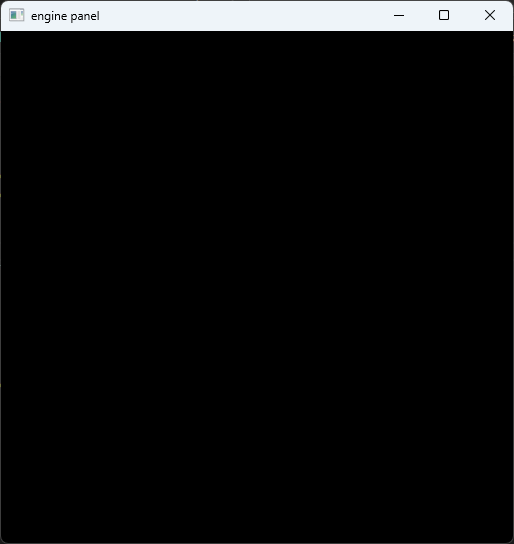
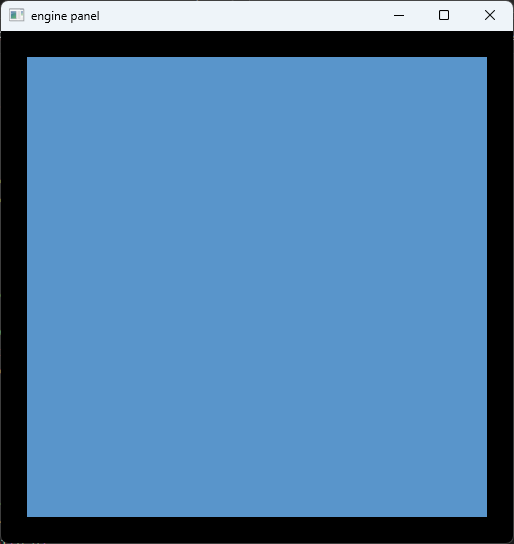
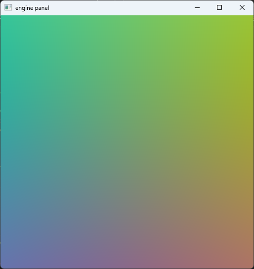
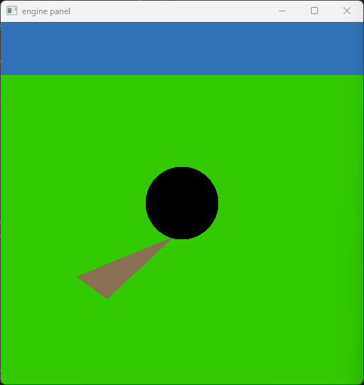
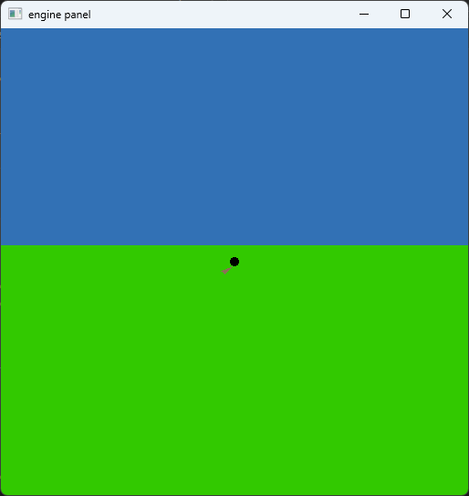
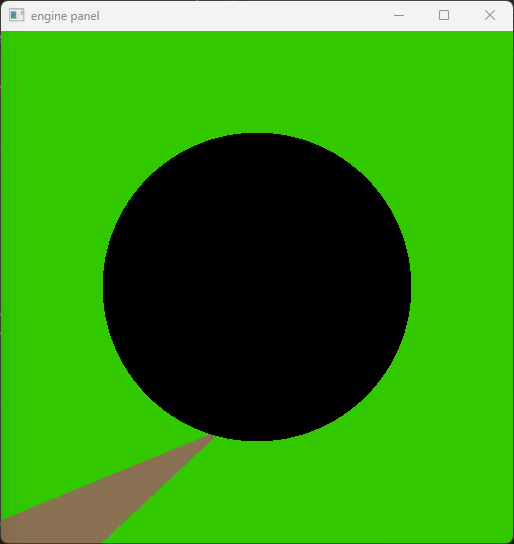
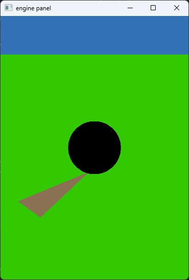
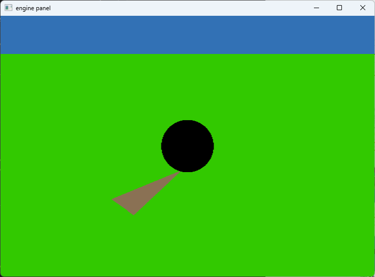
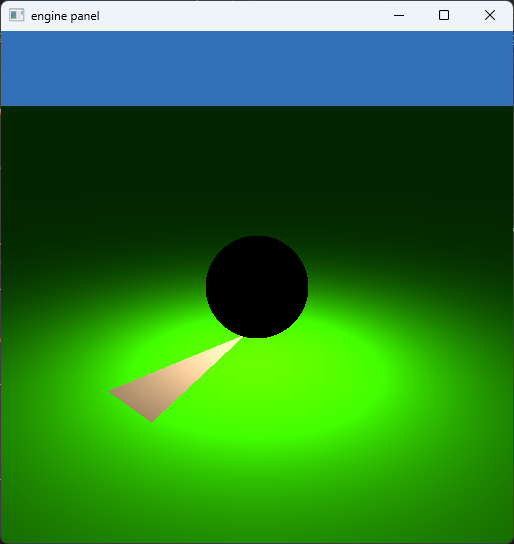

# The Basics

As I have chosen to do this project in Rust instead of Javascript, this section will differ the strongest from the prescribed exercises. 

In addition, Rust requires a much more significant amount of "boilerplate" code to manage windows, UI, and hardware access as we do not have a browser and a DOM to take care of difficult parts for us. This would also make it considerably more difficult to provide a full copy of the code for each section as that would get out of control quickly. So I ended up having to implement a lot of nominally unnecessary features  

# 1. Drawing to a Window, Clearing the Background

Done, need images, need tag

Most of the window management code is based directly on {{#cite LEARNWGPU:1}}.

Winit also supports the browser however things became very complicated fairly quickly and I had to build additional abstractions to manage this complexity, I eventually dropped trying to build for WASM.



# 2. Drawing a Rectangle

Technically I am cheating a bit here as I did not abstract the vertex buffer creation to allow different canvases. However, it is trivial to achieve a similar effect by just scaling the canvas in the vertex shader instead:

```rs
out.coords = vec2f(model.position.x * 0.9, model.position.y * 0.9);
out.clip_position = vec4<f32>(model.position * 0.9, 1.0);
```




# 3. UV Coordinates as pixel color

Camera properties are passed as uniform variables as part of a single struct.

The struct looks something like this:

```rs
#[repr(C, align(16))]
#[derive(Debug, Copy, Clone, bytemuck::Pod, bytemuck::Zeroable)]
struct Uniform {
    /// World space camera position
    camera_pos: [f32; 3],
    /// Camera constant (affects FOV)
    camera_constant: f32,
    /// Camera focus point
    camera_look_at: [f32; 3],
    /// Aspect ratio of the window (for Horz+ correction)
    aspect_ratio: f32,
    /// Which way is "up"
    camera_up: [f32; 3],

    /* snip */
}
```

WebGPU struct packing and alignment rules are similar to C with the additional requirement of the minimum alignment being 16 (since GPUs benefit immensely with this alignment and you cannot pay for the cost of out of alignment memory accesses). During runtime, my application copies a wgsl struct to the end of the given shader file to avoid having to deal with potential mismatches between CPU-side definitions and what the shader expects. I had further written a really pointless procedural macro to generate a WebGPU struct directly from a Rust struct but ended up not using it in the final project.

Using a relatively straightforward formula, it is easy to create a gradient. 

Note that the exact formula and gradient may not match with what is prescribed on the worksheet.

```rs
fn get_camera_ray(uv: vec2f) -> Ray {
    let e = uniforms.camera_pos;
    let p = uniforms.camera_look_at;
    let u = uniforms.camera_up;
    let v = normalize(p - e);
    let d = 1.0;

    let b1 = normalize(cross(v, u));
    let b2 = cross(b1, v);

    let q = normalize(b1 * uv.x + b2 * uv.y + v*d);

    let ray = ray_init(q, e);
    return ray;
}


@fragment
fn fs_main(in: VertexOutput) -> @location(0) vec4<f32> {
    let uv = in.coords * 0.5;

    var result = vec3f(0.0);
    var r = get_camera_ray(uv);

    result = (r.direction + 1.0) / 2.0;


    return vec4f(result, 1.0);
}
```



# 4. Default scene

Besides the intersection functions, nothing exciting is added despite us now doing "ray tracing".




# 5. Uniform variables, Zoom and Aspect Ratio

Uniform variable support was already described in 1.3. 

The additions here mostly involve changes to the camera function:

```rs
fn get_camera_ray(uv: vec2f) -> Ray {
    /* snip */
    let d = uniforms.camera_constant;
    let aspect = uniforms.aspect_ratio;
    /* snip */
    let q = normalize(b1 * uv.x * aspect + b2 * uv.y + v*d);
    /* snip */
}
```

With these we can now control the camera constant to zoom out with a constant of 0.1:



And to zoom in with a constant of 3:



When the Window is resized, the application automatically uploads the new aspect ratio to the GPU, so you can squish the screen:



Or stretch it:




# 6. Basic shading

Shading requires no further engine support. The position of the light source just like other objects is hard coded in the shader.

```rs
fn sample_point_light(pos: vec3f) -> Light {
    let light_pos = vec3f(0.0, 1.2, 0.0);
    let light_intensity = 5.0 * vec3f(PI, PI, PI);
    var light = light_init();
    
    let dir = light_pos - pos;
    let dist = dot(dir, dir);

    light.dist = dist;
    light.l_i = light_intensity / (dist * dist);
    light.w_i = dir;

    return light;
}

```

And we have a fairly rudimentary Lambertian shader:

```rs
fn lambertian(r: ptr<function, Ray>, hit: ptr<function, HitRecord>) -> vec3f { 
    var hit_record = *hit;
    let light = sample_point_light(hit_record.position);
    let normal = hit_record.normal;

    let ambient = hit_record.base_color;
    var diffuse = hit_record.base_color * light_diffuse_contribution(light, normal, 0.0);


    return diffuse_and_ambient(diffuse, ambient);
}

fn light_diffuse_contribution(light: Light, normal: vec3f, specular: f32) -> vec3f {
    let one_minus_specular = 1.0 - specular;
    var diffuse = vec3f(dot(normal, light.w_i));
    diffuse *= light.l_i;
    diffuse *= one_minus_specular / PI;
    return diffuse;
}

fn diffuse_and_ambient(diffuse: vec3f, ambient: vec3f) -> vec3f {
    return 0.9 * diffuse + 0.1 * ambient;
}
```

