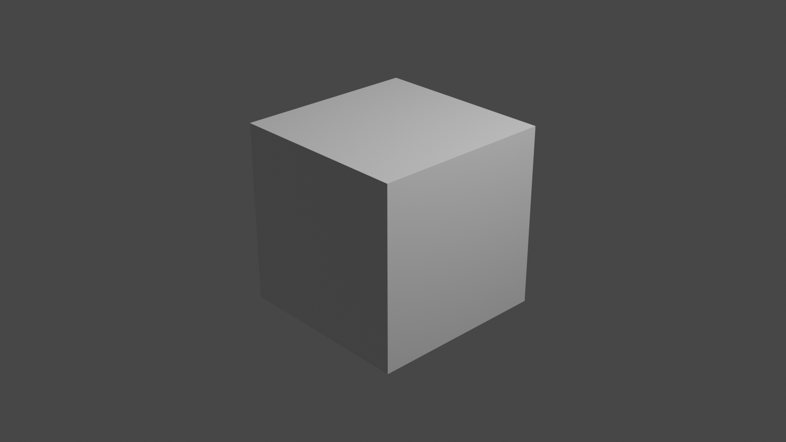
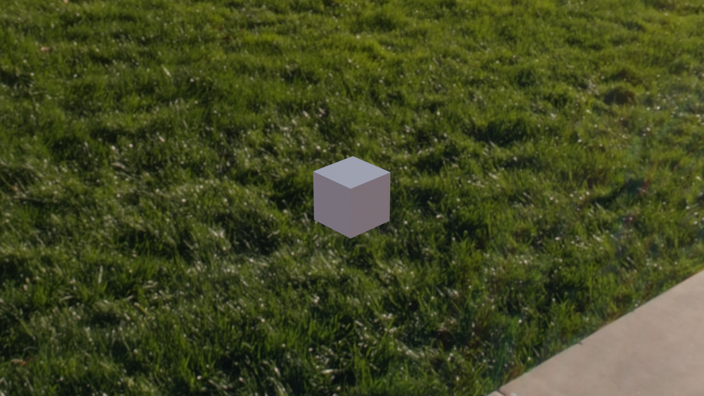
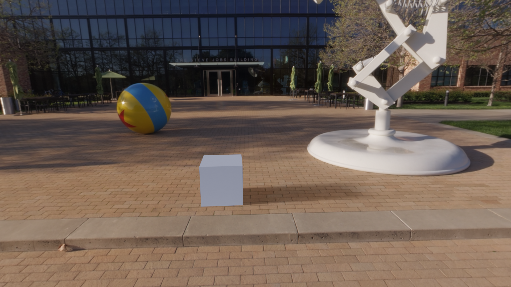
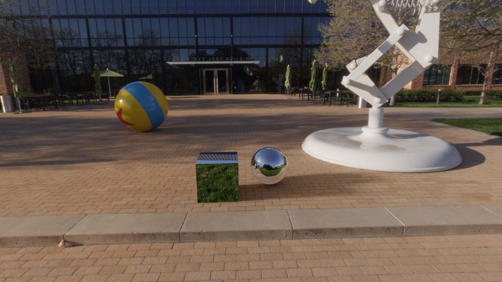
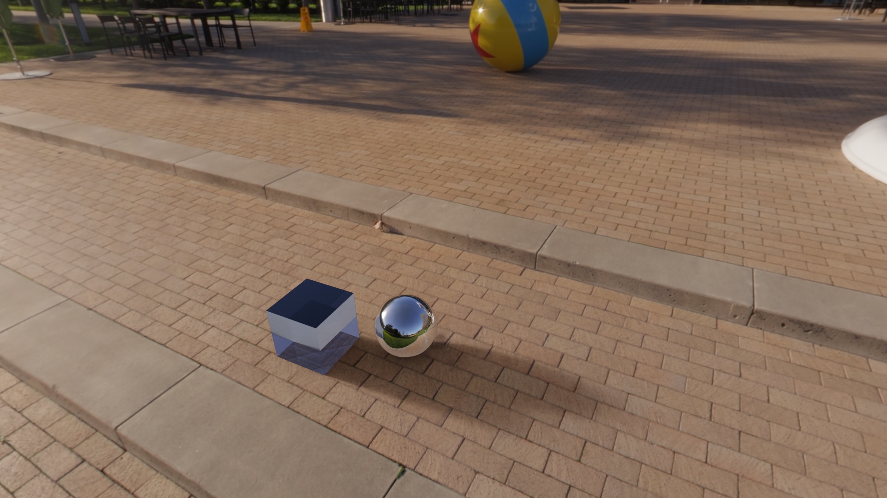
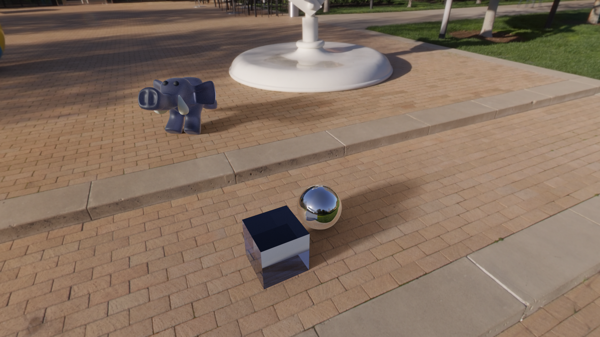

## Worksheet 10 - Blender

Ah yes, Blender my old friend. Unfortunately I am more in the modelling side of things (I wrote a whole Bachelor's thesis on it), so this part was more of an obligation unfortunately.

Create a cube, hit render:

Load an environment map, hit render:

Add a quad underneath the cube, set the rendering options to mask everything except shadows, change camera angle a bit, hit render:

And we did not even make it to the first task!

### 1. Sphere and Cube

Add a sphere and change the materials a bit.

Due to the way the environmental mapping works, any reflection that is not on a sphere ends up looking very strange as the rays hit our objects as if they come from infinitely far away.

### 2. Principled BSDF

Change some more parameters and change the camera angle again.

I kind of feel I should look into how I can add some blur to the rendered objects to mask them being obvious fake additions to the scene which is clearly way grainier resolution than our pristine objects.

### 3. "Cool" Scene

I did not have the time, sorry.

### 4. Discussion

It is worth noting that Cycles is an extremely powerful production ready offline renderer that can scale to multiple machines. Although no feature length film has yet been rendered in Blender, it is certainly possible to make one, given there have been many high quality shorts. In addition, it is also open source although using the somewhat restrictive GNU Public License, so it can be extended as needed if the built in feature set is inadequate. And if it is still not enough, may I suggest something like MoonRay @@MOONRAY:5 ?

The case where Cycles does not make sense is when there is already a large staff of engineers on hand to develop highly fine tuned renderer for specific production needs. Those needs are unfortunately a bit out of scope for this section but may involve interfacing better with existing hardware/software of the studio, hybrid biased/unbiased rendering as pure path tracing still tends to be way too expensive for feature films, material workflows that aren't supported by Blender and so on.

Moving onto frustrations I have had with WebGPU relative to Cycles. One problem is Cycles was engineered to have many different backends that provide the same result. There is a CPU backend, a CUDA backend, an OptiX backend, an AMD HIP backend, a oneAPI backend, and a Metal Compute backend. On one hand, this is a serious problem and it is very costly to support all of these backends which are hardware specific. WebGPU supports all of those use cases except pure-CPU after all. The problem is all of these are specialized compute APIs that are quite ergonomic to use with additional rendering features for visualization. While WebGPU does have compute capabilities, it is immature to say the least and we did not use those during this course.

We had to run a vertex shader and interpolators which served absolutely no purpose besides calculating the same UV coordinates each frame. We had a ton of boilerplate code to manage this. Storage buffers on the other hand, which are the bread and butter of compute APIs were among the least ergonomic things to use in WebGPU. You know how complicated it is to use a storage buffer in CUDA? You just create the buffer on the host, and then you get a pointer in the kernel. None of this song and dance of bind group layouts, bind groups, and having to have everything separately declared in shaders. And CUDA lets you write everything in one language. It is also well worth noting that debugging pixel shaders is not a positive experience at all. On the positive side, we just draw to the window when we are done and do not have to specifically setup rendering. It might also just be a case of "the grass is greener" and I might end up having different complaints if I had to do this all in CUDA or HIP.