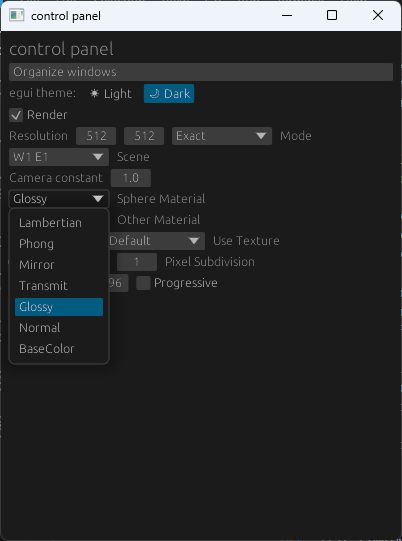

## Worksheet 2 - Ray Tracing

### 1. Shadow Rays

This part requires no extra engine support. To do shadow rays, we just trace through the scene one more time inside the shader and return ambient only if we hit anything:

```rs
fn lambertian(r: ptr<function, Ray>, hit: ptr<function, HitRecord>) -> vec3f { 
    /* snip */

    let ray_dir = light.w_i;
    let ray_orig = hit_record.position + hit_record.normal * ETA;
    var ray = ray_init(ray_dir, ray_orig);

    let blocked = intersect_scene(&ray, hit);
    let ambient = hit_record.shader.base_color;
    var diffuse = hit_record.shader.base_color * light_diffuse_contribution(light, normal, 0.0);

    // ambient only
    if (blocked) {
        return ambient * 0.1;
    } else { // ambient and diffuse
        return diffuse_and_ambient(diffuse, ambient);
    }
}
```


There is no need to create a new Ray or HitRecord here since we do not reuse the one we have later although this ended up causing a nasty bug later on when I did not realize the problem.

#### 1.b. Shade switch

Since my application does not run on a browser, I had to use a UI framework. I would like to thank the DTU PhD student A.B. Sørensen for providing a reference program that is the basis of the GUI implementation, the code can be found in {{#cite EGUITEMPLATE:2}}.

I did not put in a significant amount of work into dynamically loading relevant UI elements based on worksheet, so most of everything is displayed at any moment:


Multiple materials can be selected using the dropdown menu:



The basic idea is that the UI thread passes the changes to the rendering thread which updates relevant parameters in the render engine as well as uniform variables.

```rs
#[derive(Debug)]
pub enum Command {
    /* snip */
    SetCameraConstant { constant: f32 },
    SetSphereMaterial { material: ShaderType },
    SetOtherMaterial { material: ShaderType },
    /* snip */
}

pub enum ShaderType {
    Lambertian = 0,
    Phong = 1,
    Mirror = 2,
    Transmit = 3,
    Glossy = 4,
    Normal = 5,
    BaseColor = 6,
}
```

In this case, we just pass to the uniform:

```rs
#[repr(C, align(16))]
#[derive(Debug, Copy, Clone, bytemuck::Pod, bytemuck::Zeroable)]
struct Uniform {
    /* snip */

    /// selection 1 for branching
    selection1: u32,
    /// selection 2 for branching
    selection2: u32,

    /* snip */
}
```

And on every render pass, the uniform buffer is copied to the GPU again:

```rs

pub struct UniformGpu {
    uniforms: Uniform,
    buffer: wgpu::Buffer,
    /* snip */
}

/* snip */
impl UniformGpu {
    fn update_buffer(&self, queue: &wgpu::Queue) {
        queue.write_buffer(&self.buffer, 0, bytemuck::cast_slice(&[self.uniforms]));
        /* snip */
    }
}

```


### 2. Mirror shading

Doing perfect mirrors turns out to be extremely easy. Take the normal, reflect the ray based on the normal, return 0 and trace another ray. Note that `ray_init()` already sets a minimum distance so we do not hit the same object again immediately. 

```rs
fn mirror(r: ptr<function, Ray>, hit: ptr<function, HitRecord>) -> vec3f { 
    let normal = (*hit).normal;
    let ray_dir = reflect((*r).direction, normal);
    let ray_orig = (*hit).position;
    *r = ray_init(ray_dir, ray_orig);

    (*hit).has_hit = false;

    return vec3f(0.0);
}
```


### 3. Refraction

Refraction on the other hand is quite complicated and has a lot of subtleties.

Since normals are assumed to face outwards, we take the dot product of the surface normal and the incident ray to figure out if we hit the inside or outside the object. We set the "outward" normal and invert the ior value as needed and then calculate the new ray.

```rs
fn transmit(r: ptr<function, Ray>, hit: ptr<function, HitRecord>) -> vec3f {
    let w_i = -normalize((*r).direction);
    let normal = normalize((*hit).normal);
    var out_normal = vec3f(0.0);

    var ior = (*hit).shader.ior1_over_ior2;
    // figure out if we are inside or outside
    let cos_thet_i = dot(w_i, normal);
    // normals point outward, so if this is positive
    // we are inside the object
    // and if this is negative, we are outside
    if (cos_thet_i < 0.0) {
        // outside
        out_normal = -normal;
    } else {
        // inside
        ior = 1.0 / ior;
        out_normal = normal;
    }

    let cos_thet_t_2 = (1.0 - (ior*ior) * (1.0 - cos_thet_i * cos_thet_i));
    if (cos_thet_t_2 < 0.0) {
        return error_shader();
    }
    let tangent = ((normal * cos_thet_i - w_i));
    
    let w_t = ior * tangent - (out_normal * sqrt(cos_thet_t_2));
    let orig = (*hit).position;

    *r = ray_init(w_t, orig); 
    (*hit).has_hit = false;

    return vec3f(0.0, 0.0, 0.0);
}

```


### 4. Phong reflection

And the phong reflection model. This one I actually got wrong for the longest time until I eventually sat down and wrote it correctly. The worst part was retaking all of the screenshots really.

```rs
fn phong(r: ptr<function, Ray>, hit: ptr<function, HitRecord>) -> vec3f { 
    let specular = (*hit).shader.specular;
    let s = (*hit).shader.shininess;
    let normal = (*hit).normal;
    let position = (*hit).position;

    let w_o = normalize(uniforms.camera_pos - position); // view direction
    let light = sample_point_light(position);
    let w_r = normalize(reflect(-light.w_i, normal));
    let diffuse = saturate(vec3f(dot(normal, light.w_i))) * light.l_i / PI;
    let w_o_dot_w_r = dot(w_o, w_r);
    let coeff = specular * (s + 2.0) / (2.0 * PI);

    let phong_overall = coeff * pow(saturate(w_o_dot_w_r), s) * diffuse;
    return vec3f(phong_overall);
}
```


### 5. Glossy shader

The glossy shader implementation is trivial.

```rs
fn glossy(r: ptr<function, Ray>, hit: ptr<function, HitRecord>) -> vec3f {
    return phong(r, hit) + transmit(r, hit);
}
```


