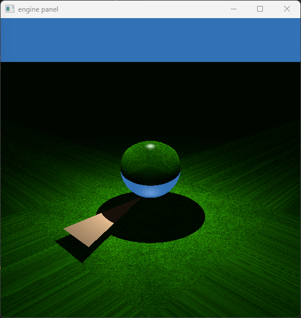
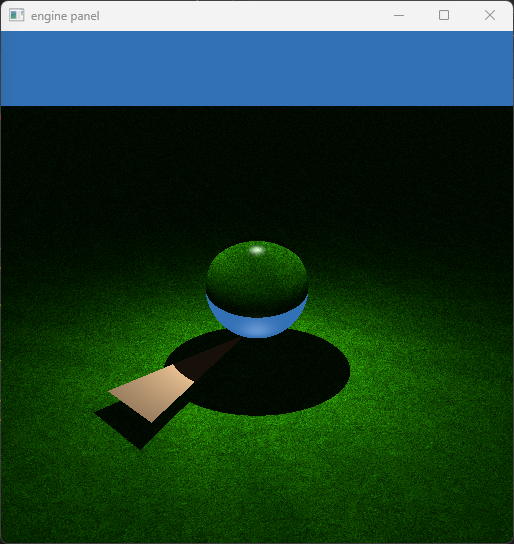
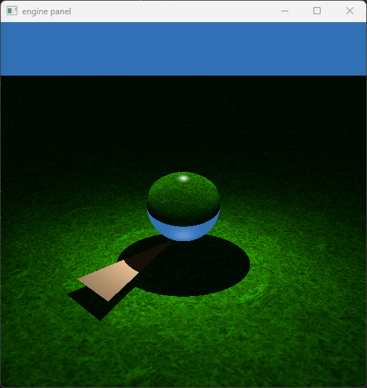
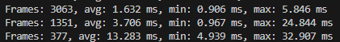
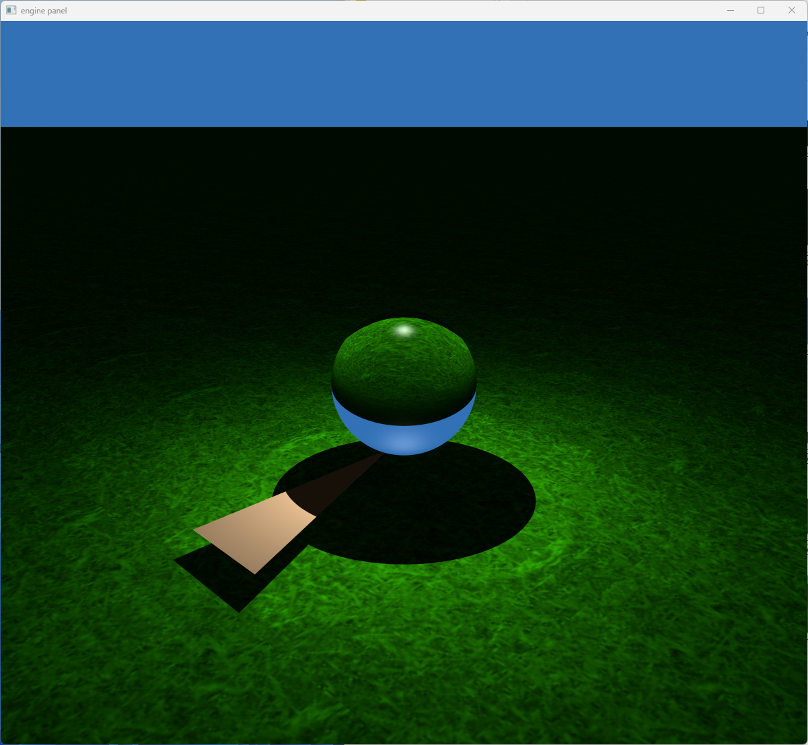

## Texture Mapping and Anti-aliasing

Before we start, a little note on the screenshots. I took these before I actually implemented phong shading correctly, so you will see an overly weak phong reflection on all of the screenshots. 

Another thing to note is the colors are a bit off in the screnshots. I am not sure what precisely causes the difference in colors as browsers may do some operations behind our back that might change color reproduction. For what it is worth, I think my screenshots are a pretty good match for the references but they appear to have higher dynamic range (browser clips range to 20-235?).

### 1. Texture mapping

Adding supports for textures is not too exciting.

I ended up with the following structure by the end so I could use a bunch of frontend code to easily change the sampler type:

```rs
pub struct Texture {
    pub name: String,
    _texture: wgpu::Texture,
    view: wgpu::TextureView,
    sampler_default: Option<(String, wgpu::Sampler)>,
    sampler_bilinear: Option<(String, wgpu::Sampler)>,
    sampler_no_filtering: Option<(String, wgpu::Sampler)>,
}
```

Most of the texture creation code has been taken directly from {{#cite LEARNWGPU:1}} as there is not much special about it besides specifying way more parameters compared to the Javascript API. Details can be seen in `bindings/texture.rs`.

I will have to disappoint by mentioning all of my samplers are using clamp to edge. Since it is very easy to imitate "repeat" address mode in the shader.

We modify the plane intersection like the following for the clamp:

```rs
struct Onb {
    tangent: vec3f,
    binormal: vec3f,
    normal: vec3f,
};

fn intersect_plane(r: ptr<function, Ray>, hit: ptr<function, HitRecord>, plane: Onb, position: vec3f) -> bool {
    let normal = plane_onb.normal;
    let distance = dot((position - (*r).origin), normal)/(dot((*r).direction, normal));
    if (distance < (*r).tmin || distance > (*r).tmax) {
        return false;
    }
    (*r).tmax = distance;
    (*hit).dist = distance;
    let pos = ray_at((*r), distance);
    (*hit).position = pos;
    (*hit).normal = normal;

    let u = dot((pos - position), plane.tangent);
    let v = dot((pos - position), plane.binormal);

    (*hit).uv0 = vec2f(abs(u), abs(v));
    return true;
}
```



And to get a repeating apperance, we take the modulo (fraction):

```rs
    let u = dot((pos - position), plane.tangent) % 1.0;
    let v = dot((pos - position), plane.binormal) % 1.0;
```

(The stupidly pedantic type checker of Naga somehow does not complain even though modulo does not make sense on floats, maybe the only meaning (fraction) is so obvious that there was no reason to complain.)



I also added a uv scale directly to the sampling function rather than hardcoding it:

```rs
fn texture_sample(hit: ptr<function, HitRecord>) -> vec3f {
    var uv0_scaled = fract((*hit).uv0 * uniforms.uv_scale);
    let result = textureSample(texture0, sampler0, uv0_scaled).xyz;
    return result;
}
```

The scale is set to 0.2 in both axes in the following screenshot:




### 2. Stratified jitter sampling

For jitter sampling, the Rust struct responsible for holding the uniform state creates a storage buffer:

```rs
let jitter_buffer = device.create_buffer_init(&wgpu::util::BufferInitDescriptor {
    label: Some("Jitter buffer"),
    contents: bytemuck::cast_slice(jitter_array.as_slice()),
    usage: wgpu::BufferUsages::STORAGE | wgpu::BufferUsages::COPY_DST,
});
```

The code to create an array is a fairly direct translation of the javascript code. Rust does not have a built in source of random bits, so permuted congruential generator from the rand_pcg crate which is a high performance PRNG.

```rs
fn compute_jitters(pixel_size: f64, subdivs: u32) -> Vec<[f32; 2]> {
    assert!(subdivs <= MAX_SUBDIVISION && subdivs > 0 && pixel_size != 0.0);
    let mut jitter_vectors = vec![];
    use rand::prelude::*;
    use rand_pcg::Lcg64Xsh32;
    let mut rng = Lcg64Xsh32::new(0, 0);
    let step = pixel_size / subdivs as f64;
    if subdivs == 1 {
        jitter_vectors.push([0.0, 0.0]);
        return jitter_vectors;
    } else {
        for i in 0..subdivs {
            for j in 0..subdivs {
                let u1 = rng.gen_range(0.0..1.0);
                let u2 = rng.gen_range(0.0..1.0);
                jitter_vectors.push([
                    ((u1 + j as f64) * step - pixel_size * 0.5) as f32,
                    ((u2 + i as f64) * step - pixel_size * 0.5) as f32,
                ]);
            }
        }
    }
    jitter_vectors
}
```

Changes to the shaders are pretty straightforward. We now run a square of the subdivision number of times.

```rs
    let subdiv = uniforms.subdivision_level;

    var result = vec3f(0.0);
    var textured = vec3f(0.0);
    for (var sample = 0u; sample < subdiv * subdiv; sample++) {
        var r = get_camera_ray(uv, sample);
        var hit = hit_record_init();
        // each loop is one bounce
        for (var i = 0; i < max_depth; i++) {
            /* snip */
        }
    }
    let multiplier = 1.0 / f32(subdiv * subdiv);
    result = result * multiplier;
```

We only need to update the `get_camera_ray()` function:

```rs
    /* snip */

    let j_x = jitter[sample].x;
    let j_y = jitter[sample].y;
    let q = normalize(b1 * (uv.x + j_x) * aspect + b2 * (uv.y + j_y) + v*d);

    let ray = ray_init(q, e);
    return ray;
}
```

Division 1 (1 sample per pixel (spp)):


Division 2 (4 spp)


Division 3 (9 spp)


Division 10 (100 spp)


The performance impact of added samples is quite drastic. In 5 seconds, we go from generating 3063 frames to 377 frames when going from 1 sample per pixel to 100.



Here is a high resolution image of the scene:




### 3. Filtering Comparison

With nearest "filtering" (also known as no filtering), the sampler just finds the texel in the texture closest to our uv coordinate. However, this gives textures a grainy appearance and in the abscence of mipmaps can cause some pretty undesirable amount of texel aliasing.


Thanks to Sega and Martin Marietta @@DAYTONA:3, we do have actual texture filtering. In bilinear texture filtering, the sampler chooses multiple texels closest to the uv position (typically 4, although there are some super old hardware that use 3). And performs a lerp operation based on distance. Much cleaner.


Now, I would normally end it there but there is one problem.

An interesting part of samplers is that it is possible to specify filtering behavior differently based on whether a texel is smaller than a pixel (magnified), larger than a pixel (minified) and whether mipmaps are in play.

In the following screenshot, texels that are larger than a pixel are filtered linearly and other texels use nearest neighbor. Pay close attention to the bottom fifth of the screenshot to see the cascade.


But the problem is, here is the function I used for texture sampling:

```rs
fn texture_sample(hit: ptr<function, HitRecord>) -> vec3f {
    var result = vec3f(0.0);
    var uv0_scaled = fract((*hit).uv0 * uniforms.uv_scale);
    switch (uniforms.use_texture) {
        case 1u: {
            result = textureSample(texture0, sampler0, uv0_scaled).xyz;
        }
        case 2u: {
            result = textureSample(texture0, sampler0_bilinear, uv0_scaled).xyz;
        }
        case 3u: {
            result = textureSample(texture0, sampler0_nearest, uv0_scaled).xyz;
        }
        default: {
            // no texture
        }
    }
    return result;
}
```

There is not enough information for sampler to make such a decision!

The reality is that a texture sample is not a pure operation. The GPU uses the partial derivative of the uv coordinate with regards to screen position for bilinear texture filtering. Normally we would have to pass this information to the shader, but we didn't, the GPU calculated it for us since texture sampling operations are issued in parallel, are fairly slow and heavily pipelined.