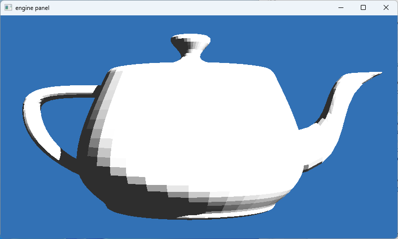
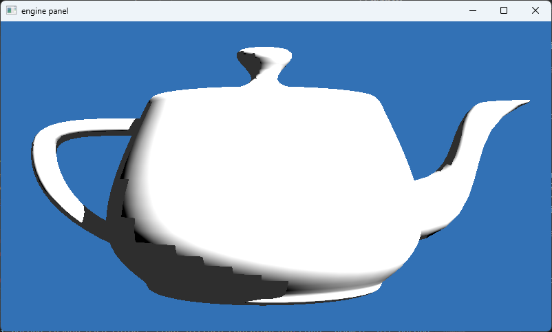
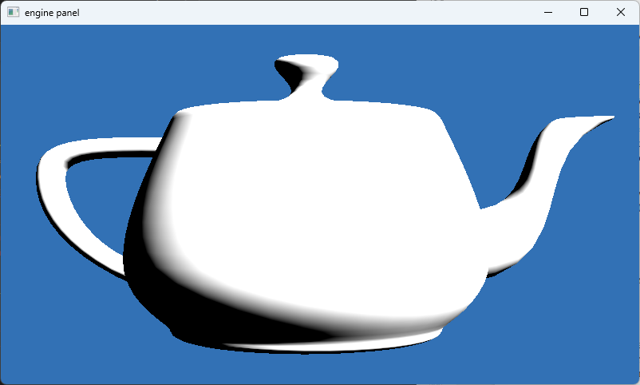
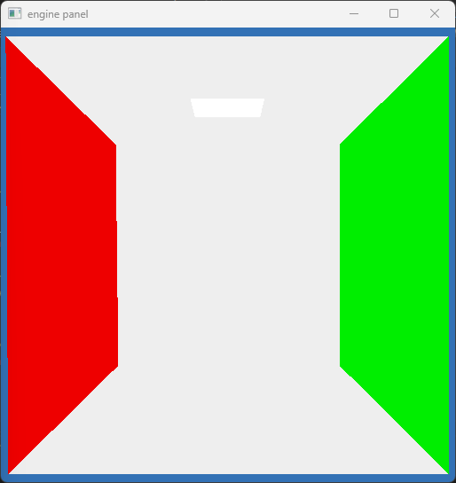
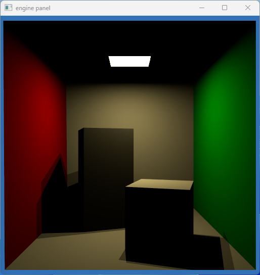

## Worksheet 5 - Triangle Meshes

Time for the big one, triangular meshes. I regret to inform you that I have in fact written a Wavefront OBJ parser before @@WAVEFRONT:4 and I was not particularly interested in writing it a second time. There are multiple options for an obj parser in Rust, the one I used is tobj.

The format I want is:

```rs
/// Mesh type containing vertices and indices in two vecs
pub struct Mesh {
    pub vertices: Vec<Vec4f32>,
    pub normals: Vec<Vec4f32>,
    /// last index in the indices contains material type
    pub indices: Vec<Vec4u32>,
    pub materials: Vec<Material>,
}
```

As it turns out, even after we get most of the data from tobj, there is quite a bit of extra work involved!

```rs
    pub fn from_obj<P>(file_name: P) -> anyhow::Result<Mesh>
    where
        P: AsRef<Path> + std::fmt::Debug,
    {
        let (models, materials_maybe) = tobj::load_obj(
            file_name,
            &tobj::LoadOptions {
                single_index: true,
                triangulate: true,
                ..Default::default()
            },
        )?;

        let materials = 
        if let Ok(materials_obj) = materials_maybe {
            /* snip */
        } else {
            vec![]
        };

        let mut vertices_flat = vec![];
        let mut normals_flat: Vec<Vec<Vec4f32>> = vec![];
        let mut indices_flat = vec![];
        models.iter().enumerate().for_each(|(idx, m)| {
            let position_number = m.mesh.positions.len() / 3;
            let normal_number = m.mesh.normals.len() / 3;
            let mut vertices = Vec::with_capacity(position_number);
            let mut normals = Vec::with_capacity(normal_number);
            for i in 0..position_number {
                vertices.push(
                    vec3f32(
                        m.mesh.positions[i * 3],
                        m.mesh.positions[i * 3 + 1],
                        m.mesh.positions[i * 3 + 2],
                    )
                    .vec4(),
                );
            }
            if normal_number == position_number {
                for i in 0..normal_number {
                    normals.push(
                        vec3f32(
                            m.mesh.normals[i * 3],
                            m.mesh.normals[i * 3 + 1],
                            m.mesh.normals[i * 3 + 2],
                        )
                        .vec4(),
                    );
                }
            } else {
                for _ in 0..position_number {
                    normals.push(
                        vec3f32(0.0, 0.0, 0.0)
                        .vec4(),
                    );
                }
            }


            let total: u32 = (0..idx)
                .map(|i| models[i].mesh.positions.len() / 3)
                .sum::<usize>() as u32;
            

            let indices = (0..m.mesh.indices.len() / 3)
                .map(|i| {
                    vec4u32(
                        total + m.mesh.indices[i * 3],
                        total + m.mesh.indices[i * 3 + 1],
                        total + m.mesh.indices[i * 3 + 2],
                        m.mesh.material_id.unwrap_or(u32::MAX as usize) as u32,
                    )
                })
                .collect::<Vec<_>>();
            vertices_flat.push(vertices);
            normals_flat.push(normals);
            indices_flat.push(indices);
        });
        let vertices_flat = vertices_flat.into_iter().flatten().collect::<Vec<_>>();
        let normals_flat = normals_flat.into_iter().flatten().collect::<Vec<_>>();
        let indices_flat = indices_flat.into_iter().flatten().collect::<Vec<_>>();

        Ok(Mesh {
            vertices: vertices_flat,
            normals: normals_flat,
            indices: indices_flat,
            materials,
        })
    }
```

I won't go into too much detail as this code was essentially provided for the js implementation but basically we just flat map the vertices, normals, and vertex indices from potentially multiple different meshes into one single mesh for our ray tracer. The reason for the verbosity iterators do not have a built in batch operation and we have to modify the face indices, although it is possible to write this much more neatly with a few extra dependencies.

### 1. Storage buffers

I skipped the warm up exercise for the one triangle since there was significantly more work involved in getting mesh loading working. The code for binding our mesh to a storage buffer is in `bindings/storage_mesh.rs`. There is a bit of indirection that was later added to handle combining vertex positions and normals.

```rs
pub struct StorageMeshGpu {
    geometry: GeometryGpu,
    materials: MaterialsGpu,
}

/* snip */

enum GeometryGpu {
    Split(GeometryGpuSplit),
    Combined(GeometryGpuCombined),
}

/* snip */

struct GeometryGpuSplit {
    vertex_buffer: wgpu::Buffer,
    vertex_normal_buffer: wgpu::Buffer,
    index_buffer: wgpu::Buffer,
}
```

We already have the vectors ready for our buffers for the split case.

```rs
impl GeometryGpuSplit {
    pub fn new(device: &wgpu::Device, mesh: &Mesh) -> Self {
        let vertex_buffer_slice = mesh.vertices.as_slice();
        let vertex_buffer = device.create_buffer_init(&wgpu::util::BufferInitDescriptor {
            label: Some("Model Vertex Buffer Split"),
            contents: bytemuck::cast_slice(&vertex_buffer_slice),
            usage: wgpu::BufferUsages::COPY_DST | wgpu::BufferUsages::STORAGE,
        });
        let vertex_normal_slice = mesh.normals.as_slice();
        let vertex_normal_buffer = device.create_buffer_init(&wgpu::util::BufferInitDescriptor {
            label: Some("Model Vertex Normal Buffer Split"),
            contents: bytemuck::cast_slice(&vertex_normal_slice),
            usage: wgpu::BufferUsages::COPY_DST | wgpu::BufferUsages::STORAGE,
        });

        let index_buffer_slice = mesh.indices.as_slice();
        let index_buffer = device.create_buffer_init(&wgpu::util::BufferInitDescriptor {
            label: Some("Model Index Buffer"),
            contents: bytemuck::cast_slice(&index_buffer_slice),
            usage: wgpu::BufferUsages::COPY_DST | wgpu::BufferUsages::STORAGE,
        });

        Self {
            vertex_buffer,
            vertex_normal_buffer,
            index_buffer,
        }
    }
}
```

### 2. Utah Teapot

We also need to update the triangle intersection. I decided to just wrap the function instead:

```rs
fn intersect_triangle_indexed(r: ptr<function, Ray>, hit: ptr<function, HitRecord>, v: u32) -> bool {
    let v1 = indexBuffer[v].x;
    let v2 = indexBuffer[v].y;
    let v3 = indexBuffer[v].z;
    let arr = array<vec3f, 3>(vertexBuffer[v1].xyz, vertexBuffer[v2].xyz, vertexBuffer[v3].xyz);
    return intersect_triangle(r, hit, arr);
}
```

And add a function to loop through all the triangles:

```rs
    let num_of_tris = arrayLength(&indexBuffer);
    for (var i = 0u; i < num_of_tris; i++) {
        has_hit = has_hit || wrap_shader(intersect_triangle_indexed(r, hit, i), hit, shader);
    }
```

And we can see the Teapot.



Our teapot is painfully slow however. With my fans immediately going into full blast.


Nearly a hundred miliseconds for a frame! And we do not even have indirect lighting yet.

#### 2.b. Directional light

Directional lights are super simple as they are essentially point
lights that are infinitely far away, this ends up simplifying much
of the required math.

```rs
fn sample_directional_light(pos: vec3f) -> Light {
    // a directional light is much like a point light, but the intensity
    // is independent of the distance
    let light_direction = -normalize(vec3f(-1.0));
    let light_intensity = 5.0 * vec3f(PI, PI, PI);
    let distance = 1.0;
    var light = light_init();
    light.l_i = light_intensity;
    light.dist = distance;
    light.w_i = light_direction;
    return light;
}
```

I set the distance to 1.0 instead of an arbitrarily high value, so any additional division does not do anything.

### 3. Vertex normals

We already uploaded the vertex normals, so it is only a matter of using them now. I inlined the intersect_triangle function here since we ended up not using it anywhere else.

```rs
fn intersect_triangle_indexed(r: ptr<function, Ray>, hit: ptr<function, HitRecord>, v: u32) -> bool {
    let v0_i = indexBuffer[v].x;
    let v1_i = indexBuffer[v].y;
    let v2_i = indexBuffer[v].z;
    let v0 = vertexBuffer[v0_i].xyz;
    let v1 = vertexBuffer[v1_i].xyz;
    let v2 = vertexBuffer[v2_i].xyz;
    let n0 = normalBuffer[v0_i].xyz;
    let n1 = normalBuffer[v1_i].xyz;
    let n2 = normalBuffer[v2_i].xyz;

    /* snip */

    // barycentric coordinates
    (*hit).normal = normalize(n0 * (1.0 - beta - gamma) + n1 * beta + n2 * gamma);

    return true;
}
```

When I first ran it, I got the following result:



That is not right at all! We now have smooth shading of our teapot but the shadows are incorrect. I ended up not fixing this issue and disabled shadows instead. We only have a very small amount of self shadowing here in the first place.



### 4. Cornell Box

Ah yes, the famous Cornell box. First the materials.

```rs
#[repr(C, align(16))]
#[derive(Copy, Clone, Debug, bytemuck::Zeroable, bytemuck::Pod)]
pub struct Material {
    pub diffuse: Vec4f32,
    pub ambient: Vec4f32,
    pub specular: Vec4f32,
    pub emissive: u32,
    _padding0: [u32; 3],
}
```

We end up not using the specular tint in the Material descriptor even though I did parse it since it was in every mtl file.

And the corresponding section in the Parser:

```rs
        let materials = 
        if let Ok(materials_obj) = materials_maybe {
            materials_obj.iter().map( |m| {
                let diffuse = if let Some(diffuse) = m.diffuse {
                    diffuse.into()
                } else {
                    vec3f32(1.0, 1.0, 1.0)
                }.vec4();
                let ambient = if let Some(ambient) = m.ambient {
                    ambient.into()
                } else {
                    vec3f32(0.0, 0.0, 0.0)
                }.vec4();
                let specular = if let Some(specular) = m.specular {
                    specular.into()
                } else {
                    vec3f32(0.0, 0.0, 0.0)
                }.vec4();
                let emissive = if let Some(illumination) = m.illumination_model {
                    illumination as u32
                } else {
                    0
                };

                Material {
                    diffuse,
                    ambient,
                    specular,
                    emissive,
                    _padding0: [0, 0, 0],
                }
            }).collect()
        } else {
            vec![]
        };
```

I simplify the shade function a lot here since we will slowly add them back:

```rs
fn shade(r: ptr<function, Ray>, hit: ptr<function, HitRecord>) -> vec3f {
    var color = vec3f(0.0, 0.0, 0.0);
    (*hit).has_hit = true;
    (*hit).depth += 1;

    let index = (*hit).material;
    color = materials[index].diffuse.xyz + materials[index].ambient.xyz;

    return color;
}
```




### 5. Emission

Time to readd proper lighting.

The area light sampling function is much more complicated than the point and directional lights:

```rs
fn sample_area_light(pos: vec3f, idx: u32) -> Light {
    let light_tri_idx: u32 = lightIndices[idx];
    let light_triangle: vec4u = indexBuffer[light_tri_idx];
    let v0 = vertexBuffer[light_triangle.x].xyz;
    let v1 = vertexBuffer[light_triangle.y].xyz;
    let v2 = vertexBuffer[light_triangle.z].xyz;
    let area = triangle_area(v0, v1, v2);
    let light_mat = materials[light_triangle.w];
    let l_e = light_mat.ambient.xyz;
    let center = (v0 + v1 + v2) / 3.0;
    let normal = normalize(cross((v0 - v1), (v0 - v2)));

    let light_direction = center - pos;
    let cos_l = dot(normalize(-light_direction), normal);
    let distance = sqrt(dot(light_direction, light_direction));
    let light_intensity = (l_e * area) * cos_l / (distance * distance);
    var light = light_init();
    light.l_i = light_intensity;
    light.w_i = normalize(light_direction);
    light.dist = distance;
    return light;
}
```

First, we get the triangle vertex positions, and the light intensity from the material buffer. We calculate the center of the vertices as the origin of the lightsource, we also calculate the triangle area.

We can then calculate the incident light by multiplying the intensity, area, cosine term from light direction and divide by the distance squared. I had done the final division at a different place initially but I moved it here for clarity.

We also need to update the Lambertian:

```rs
fn lambertian(r: ptr<function, Ray>, hit: ptr<function, HitRecord>) -> vec3f { 
    let normal = (*hit).normal;
    let material = get_material(hit);
    let bdrf = material.diffuse.rgb;
    
    var diffuse = vec3f(0.0);

    let light_tris = arrayLength(&lightIndices);
    var hit_record = hit_record_init();
    for (var idx = 1u; idx < light_tris; idx++) {
        let light = sample_area_light((*hit).position, idx);

        let ray_dir = light.w_i;
        let ray_orig = (*hit).position;
        var ray = ray_init(ray_dir, ray_orig);
        ray.tmax = light.dist - ETA;

        let blocked = intersect_scene_loop(&ray, &hit_record);
        if (!blocked) {
            diffuse += bdrf * vec3f(dot(normal, light.w_i)) * light.l_i / PI;
        }
    }
    let ambient = material.ambient.rgb;

    return diffuse + ambient;
}
```

Unfortunately, what we are doing is not that great, we are looping over every area light triangle and we are looping over every triangle on the scene for the shadow rays. Thankfully the scene is simple.



The problem is obvious here. We have two illuminating triangles which we are modelling as pointlights which create this super sharp unrealistic penumbra. The next step is to fix that.