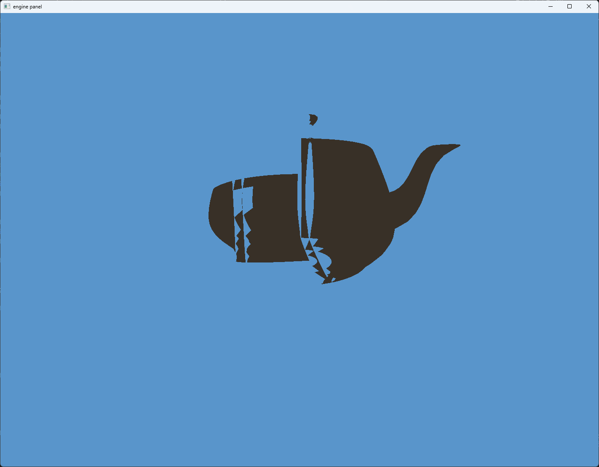
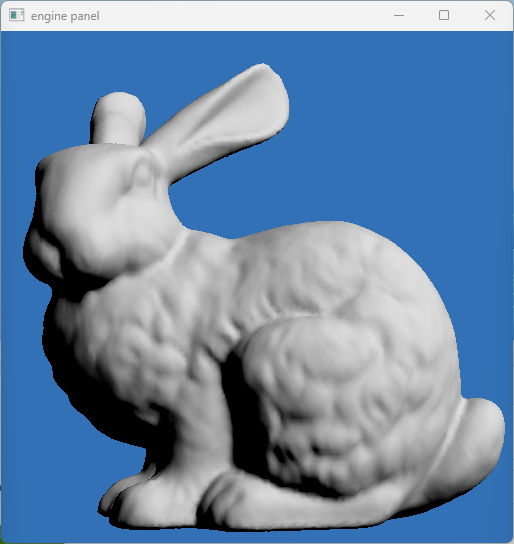
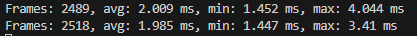
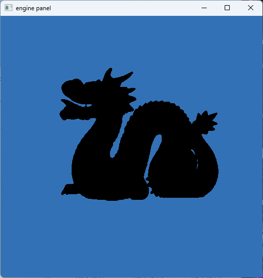
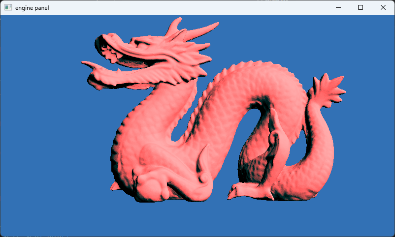
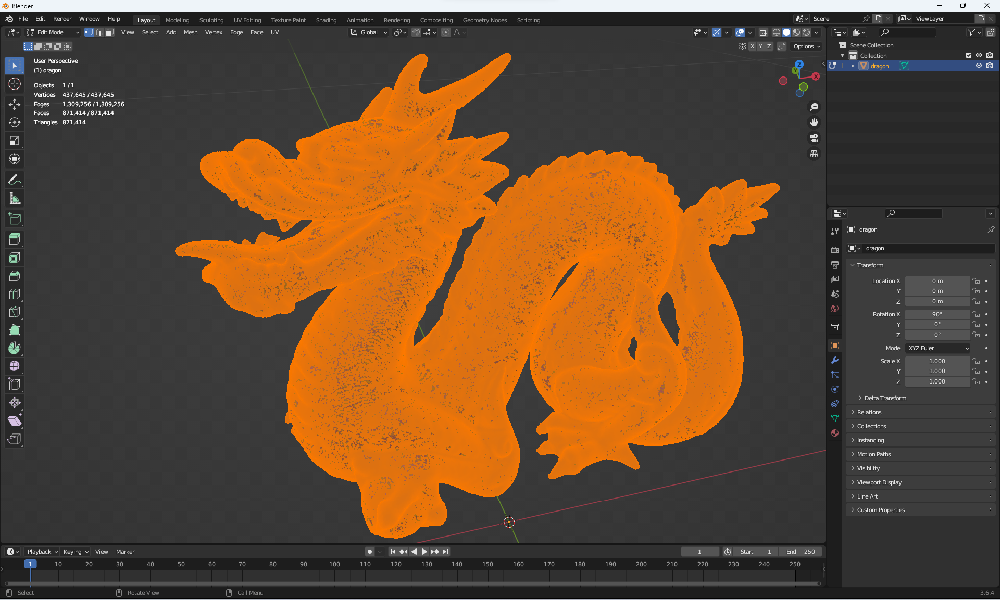
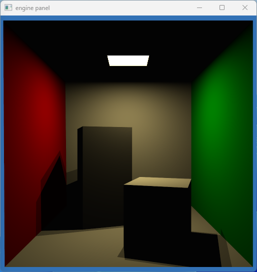
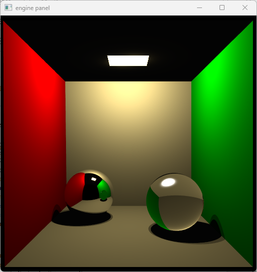
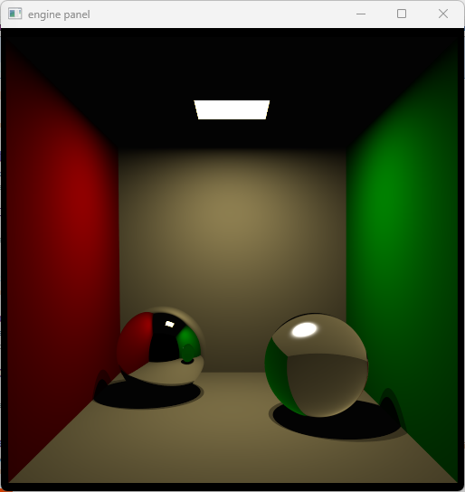

## Worksheet 6 - Binary Space Partitioning

Now we reach binary space partitioning, this was by far the most time consuming worksheet out of every single one as I had to port Javascript code without type information to Rust. My goal was to stick very close to the original code as possible to minimize potential errors but ended up wasting an entire day on a one line error. The bsp code can mostly be found on the `data_structures` folder.

First the bbox type:

```rs
/// ### Bounding Box
/// Axis aligned bounding box type
#[repr(C)]
#[derive(Debug, Clone, Copy)]
pub struct Bbox {
    pub min: Vec3f32,
    pub max: Vec3f32,
}
```

This is pretty much identical to the C++ Optix implementation which is pretty straightforward, so I will not go into much detail. I need another intermediate data structure however:

```rs
/// Intermediate data structure to pass
/// indexed bounding boxes to the BSP Tree
///
/// Each index points towards the primitive (in this case the triangle)
/// in the index buffer that corresponds to the bbox
#[derive(Debug, Copy, Clone)]
pub struct AccObj {
    idx: u32,
    bbox: Bbox,
}
```

In my Rust BSP implementation, I do not create the GPU buffers directly, I first create a recursive BSP tree and then I convert this to the representation we want on the GPU, so I need to store the triangle indices in our intermediate data structure.

The actual data structure is composed of two record types and two sum types. First we have the top level type which just carries the root node, the max depth (can also be parametrized but no need to use generics here) and the bounding box for the entire object:

```rs
#[derive(Debug)]
pub struct BspTree {
    root: Node,
    max_depth: u32,
    bbox: Bbox,
}
```

The actual nodes themselves always carry the total number of elements of all of the child nodes combined. If they are leaf nodes, they carry the bounding boxes and the triangle indices for the bounding boxes, if they are intermediate nodes, they carry a split type, the split plane, and left and right nodes:

```rs
#[derive(Debug)]
struct Node {
    count: usize,
    node_type: NodeType,
}

#[derive(Debug)]
enum NodeType {
    Leaf {
        objects: Vec<AccObj>,
    },
    Split {
        split: Split,
        plane: f32,
        left: Box<Node>,
        right: Box<Node>,
    },
}
```

The split is a simple enumeration:

```rs
#[derive(Debug, Copy, Clone)]
enum Split {
    AxisX = 0,
    AxisY = 1,
    AxisZ = 2,
}
```

I have reimplemented the `subdivide_node()` function in the javascript code to output this data structure:

```rs
    /// Create a complete Node hierarchy using subdivision
    fn subdivide_node(
        bbox: Bbox,
        depth: u32,
        max_depth: u32,
        max_objects_on_leaf: u32,
        objects: &Vec<&AccObj>,
    ) -> Node {
        let tests = 4;

        if objects.len() as u32 <= max_objects_on_leaf || depth == max_depth {
            let node = Node {
                count: objects.len(),
                node_type: NodeType::Leaf {
                    objects: objects.iter().map(|elem| (*elem).clone()).collect(),
                },
            };
            node
        } else {
            // split the objects
            let mut axis_leaf = 0;
            let mut plane: f32 = 0.0;
            let mut left_node_count = 0;
            let mut right_node_count = 0;
            let mut _debug = false;
            let mut min_cost = 1E+27;
            for i in 0..3 {
                for k in 1..tests {
                    let mut left_bbox = bbox.clone();
                    let mut right_bbox = bbox.clone();
                    let max_corner = bbox.max[i];
                    let min_corner = bbox.min[i];
                    let center =
                        (max_corner - min_corner) * (k as f32) / (tests as f32) + min_corner;
                    left_bbox.max[i] = center;
                    right_bbox.min[i] = center;

                    let mut left_count = 0;
                    let mut right_count = 0;
                    for obj in objects {
                        left_count += left_bbox.intersects(&obj.bbox) as i32;
                        right_count += right_bbox.intersects(&obj.bbox) as i32;
                    }

                    let cost = left_count as f32 * left_bbox.area()
                        + right_count as f32 * right_bbox.area();
                    if cost < min_cost {
                        min_cost = cost;

                        axis_leaf = i;
                        plane = center;
                        left_node_count = left_count;
                        right_node_count = right_count;
                    }
                }
            }

            // Choose the splitting plane
            let max_corner = bbox.max[axis_leaf];
            let min_corner = bbox.min[axis_leaf];
            let size = max_corner - min_corner;
            let diff = if F_EPS < (size / 8.0) {
                size / 8.0
            } else {
                F_EPS
            };
            let mut center = plane;

            if left_node_count == 0 {
                center = max_corner;
                for obj in objects {
                    let obj_min_corner = obj.bbox.min[axis_leaf];
                    if obj_min_corner < center {
                        center = obj_min_corner;
                    }
                }
                center -= diff;
            }
            if right_node_count == 0 {
                center = min_corner;
                for obj in objects {
                    let obj_max_corner = obj.bbox.max[axis_leaf];
                    if obj_max_corner > center {
                        center = obj_max_corner;
                    }
                }

                center += diff;
            }

            plane = center;
            let mut left_bbox = bbox.clone();
            let mut right_bbox = bbox.clone();
            left_bbox.max[axis_leaf] = center;
            right_bbox.min[axis_leaf] = center;

            let mut left_objects = vec![];
            let mut right_objects = vec![];

            for obj in objects {
                if left_bbox.intersects(&obj.bbox) {
                    left_objects.push(*obj);
                }
                if right_bbox.intersects(&obj.bbox) {
                    right_objects.push(*obj);
                }
            }
            Node {
                count: objects.len(),
                node_type: NodeType::Split {
                    left: Box::new(Self::subdivide_node(
                        left_bbox,
                        depth + 1,
                        max_depth,
                        max_objects_on_leaf,
                        &left_objects,
                    )),
                    right: Box::new(Self::subdivide_node(
                        right_bbox,
                        depth + 1,
                        max_depth,
                        max_objects_on_leaf,
                        &right_objects,
                    )),
                    split: axis_leaf.into(),
                    plane: plane,
                },
            }
        }
    }
```

The only notable differences are instead of relying on globals, we cache information that we need or just calculate it on the second step where we convert this to a GPU format.

### 1. Axis aligned BSP Tree

I made a very simple error initially during the recursion:

```rs
            Node {
                count: objects.len(),
                node_type: NodeType::Split {
                    left: Box::new(Self::subdivide_node(
                        left_bbox,
                        depth + 1,
                        max_depth,
                        max_objects_on_leaf,
                        &left_objects,
                    )),
                    right: Box::new(Self::subdivide_node(
                        right_bbox,
                        depth + 1,
                        max_depth,
                        max_objects_on_leaf,
                        &left_objects, // oops
                    )),
                    split: axis_leaf.into(),
                    plane: plane,
                },
            }
```

The results speak for themselves:



After the BspTree is generated, we need to convert it to something that the GPU can use.

I used the same format as the Javascript code:

```rs
#[derive(Debug)]
pub struct BspTreeIntermediate {
    pub bbox: BboxGpu,
    pub ids: Vec<u32>,
    pub bsp_tree: Vec<Vec4u32>,
    pub bsp_planes: Vec<f32>,
}
```

We need some functions to create the vectors:

```rs
    pub fn primitive_ids(&self) -> Vec<u32> {
        let mut ids = Vec::with_capacity(self.count() as usize);

        fn primitive_ids_recursive(node: &Node, array: &mut Vec<u32>) {
            match &node.node_type {
                NodeType::Leaf { objects } => {
                    objects.iter().for_each(|obj| array.push(obj.idx));
                }
                NodeType::Split {
                    left,
                    right,
                    split: _,
                    plane: _,
                } => {
                    primitive_ids_recursive(&left, array);
                    primitive_ids_recursive(&right, array);
                }
            }
        }

        primitive_ids_recursive(&self.root, &mut ids);
        ids
    }

    ///
    /// Constructs bsp_planes and bsp_array
    ///
    /// ```
    /// bsp_planes: Vec<f32> = vec![];
    /// ```
    ///
    /// ```
    /// bsp_array: Vec<Vec4u32> = vec![];
    ///  // .0 = (xxxx xxTT) : node_type
    ///  // .0 = (CCCC CCxx) : node_count
    ///  // .1 = node_id
    ///  // .2 = left_node_id
    ///  // .3 = right_node_id
    ///  
    /// ```
    ///
    pub fn bsp_array(&self) -> (Vec<f32>, Vec<Vec4u32>) {
        let bsp_tree_nodes: usize = (1 << (self.max_depth + 1)) - 1;
        let mut bsp_planes = vec![0.0; bsp_tree_nodes];
        let mut bsp_array = vec![Default::default(); bsp_tree_nodes];

        fn build_bsp_array_recursive(
            bsp_planes: &mut [f32],
            bsp_array: &mut [Vec4u32],
            node: &Node,
            depth: u32,
            max_depth: u32,
            branch: u32,
            node_id: &mut u32,
        ) {
            if depth > max_depth {
                return;
            }
            let idx = ((1 << depth) + branch - 1) as usize;
            bsp_array[idx].1 = 0;
            bsp_array[idx].2 = (1 << (depth + 1)) + 2 * branch - 1;
            bsp_array[idx].3 = (1 << (depth + 1)) + 2 * branch;
            bsp_planes[idx] = 0.0;
            match &node.node_type {
                NodeType::Leaf { objects } => {
                    bsp_array[idx].0 = NODE_TYPE_LEAF + (node.count << 2) as u32;
                    bsp_array[idx].1 = *node_id;
                    *node_id += objects.len() as u32;
                }
                NodeType::Split {
                    left,
                    right,
                    split,
                    plane,
                } => {
                    bsp_array[idx].0 = *split as u32 + (node.count << 2) as u32;
                    bsp_planes[idx] = *plane;
                    build_bsp_array_recursive(
                        bsp_planes,
                        bsp_array,
                        &left,
                        depth + 1,
                        max_depth,
                        branch * 2,
                        node_id,
                    );
                    build_bsp_array_recursive(
                        bsp_planes,
                        bsp_array,
                        &right,
                        depth + 1,
                        max_depth,
                        branch * 2 + 1,
                        node_id,
                    );
                }
            }
        }

        build_bsp_array_recursive(
            &mut bsp_planes.as_mut_slice(),
            &mut bsp_array.as_mut_slice(),
            &self.root,
            0,
            self.max_depth,
            0,
            &mut 0,
        );

        (bsp_planes, bsp_array)
    }
```

This recursive implementation is not optimal as Rust does not optimize tail calls, however since we already limited the recursion depth, this is fairly safe. And voila:



And the performance we get is quite excellent too.

However, let's try to ignore the GPU memory usage with that massive fixed size array.



Initially when I tried putting the Stanford Dragon in, I got this image:



Had to go into Blender to regenerate normals.



Looks pretty much perfect. And runs quite well too.

How many triangles do we have again?



Well then.

The traversal function has been provided, so I will not repeat it here.

### 2. Merge material index to face coordinates

I already did this from the start, so there is nothing to add here.

Included are the images of the Cornell Box again with subdivision of 1 and 4:




### 3. Cornell Box

Time to reimplement mirrors and transmission. Or that is what I would say if there was a significant change in implementation.

```rs
fn mirror(r: ptr<function, Ray>, hit: ptr<function, HitRecord>) -> vec3f { 
    let normal = (*hit).normal;
    let ray_dir = reflect((*r).direction, normal);
    let ray_orig = (*hit).position;
    *r = ray_init(ray_dir, ray_orig);
    (*hit).has_hit = false;

    return vec3f(0.0, 0.0, 0.0);
}
```

The mirror shader is exactly the same.

```rs
fn phong(r: ptr<function, Ray>, hit: ptr<function, HitRecord>) -> vec3f { 
    let specular = (*hit).specular;
    let s = (*hit).shininess;
    let normal = (*hit).normal;
    let position = (*hit).position;

    let coeff = specular * (s + 2.0) / (2.0 * PI);

    let w_o = normalize(uniforms.camera_pos - position); // view direction

    let light_tris = arrayLength(&lightIndices);
    var phong_total = vec3f(0.0);
    for (var idx = 1u; idx < light_tris; idx++) {
        let light = sample_area_light((*hit).position, idx);
        let light_dir = light.w_i;
        let light_intensity = light.l_i;
        let light_dist = light.dist;

        let w_r = normalize(reflect(-light.w_i, normal));
        let diffuse = saturate(vec3f(dot(normal, light.w_i))) * light.l_i / PI;
        let w_o_dot_w_r = dot(w_o, w_r);

        phong_total += pow(saturate(w_o_dot_w_r), s) * diffuse; // Here is a change
    }

    let phong_overall = coeff * phong_total;
    return vec3f(phong_overall);
}
```

The Phong shader has the distance squared division moved inside the area light sampling function but is otherwise unchanged.

```rs
fn transmit(r: ptr<function, Ray>, hit: ptr<function, HitRecord>) -> vec3f {
    let w_i = -normalize((*r).direction);
    let normal = normalize((*hit).normal);
    var out_normal = vec3f(0.0);

    var ior = (*hit).ior1_over_ior2;
    // figure out if we are inside or outside
    let cos_thet_i = dot(w_i, normal);
    // normals point outward, so if this is positive
    // we are inside the object
    // and if this is negative, we are outside
    if (cos_thet_i < 0.0) {
        // outside
        out_normal = -normal;
    } else {
        // inside
        ior = 1.0 / ior;
        out_normal = normal;
    }

    let cos_thet_t_2 = (1.0 - (ior*ior) * (1.0 - cos_thet_i * cos_thet_i));
    if (cos_thet_t_2 < 0.0) {
        return error_shader();
    }
    let tangent = ((normal * cos_thet_i - w_i));
    
    let w_t = ior * tangent - (out_normal * sqrt(cos_thet_t_2));
    let orig = (*hit).position;

    *r = ray_init(w_t, orig); 
    (*hit).has_hit = false;

    return vec3f(0.0, 0.0, 0.0);
}
```

The transmit function is also unchanged.




I have also shaved an earlier screenshot where I used a much more incorrect phong reflection, that is also included here:



