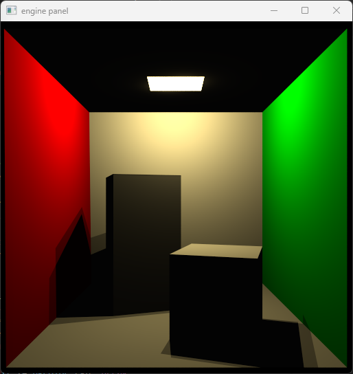

## Worksheet 7 - Progressive Path Tracing

I would say one of the most surprising parts of taking this course is how long it took for us to get to the "fun part". I am not saying that the previous exercises weren't necessarily fun, but I am saying there is a reason "Ray Tracing in One Weekend" rushes as fast as possible to get Monte Carlo working.

Ping Pong rendering ended up causing me to do one of the ugliest refactors of the code that I did, I will not go into too much detail but if you check out `render_state.rs` and notice a lot of duplication, this part was what created it.

The basic set up is that we need to hold two render textures:

```rs
pub struct RenderState {
    /* snip */
    render_source: RenderSource,
    render_destination: RenderDestination,
    /* snip */
}
```

These are then updated during the render pass:

```rs
    pub fn render(&self) -> Result<(), wgpu::SurfaceError> {
        /* snip, create the surface texture */

        /* snip, create command encoder */
        let source_view = self
            .render_source
            .texture
            .create_view(&wgpu::TextureViewDescriptor::default());
        let mut render_pass = encoder.begin_render_pass(&wgpu::RenderPassDescriptor {
            label: Some("Render Pass"),
            color_attachments: &[
                Some(wgpu::RenderPassColorAttachment {
                    /* snip, this is the surface texture */ 
                }),
                Some(wgpu::RenderPassColorAttachment {
                    view: &source_view, // source view
                    resolve_target: None,
                    ops: wgpu::Operations {
                        load: wgpu::LoadOp::Load,
                        store: true,
                    },
                }),
            ],
            /* snip */
        });

        /* snip, 
            set pipeline, 
            set vertex and index buffers, 
            set bind groups, 
            perform the render pass */ 

        encoder.copy_texture_to_texture(
            wgpu::ImageCopyTexture {
                texture: &self.render_source.texture,
                mip_level: 0,
                origin: wgpu::Origin3d::ZERO,
                aspect: wgpu::TextureAspect::All,
            },
            wgpu::ImageCopyTexture {
                texture: &self.render_destination.texture,
                mip_level: 0,
                origin: wgpu::Origin3d::ZERO,
                aspect: wgpu::TextureAspect::All,
            },
            self.render_source.texture.size(),
        );

        /* snip, order encoder to execute commands */ 
    }

```

There are further additions to the uniforms to pass the current frame number and screen size to the shader.

```rs
#[repr(C, align(16))]
#[derive(Debug, Copy, Clone, bytemuck::Pod, bytemuck::Zeroable)]
struct Uniform {
    /* snip */

    /// Which iteration this frame is for ping pong rendering
    iteration: u32,

    /* snip */

    /// resolution of the canvas for ping pong rendering
    /// and random seeding
    canvas_resolution: [u32; 2],
}
```

### 1. Ping Pong Rendering

One sample:




### 2. Soft Shadows

One sample:


### 3. Indirect Illumination


