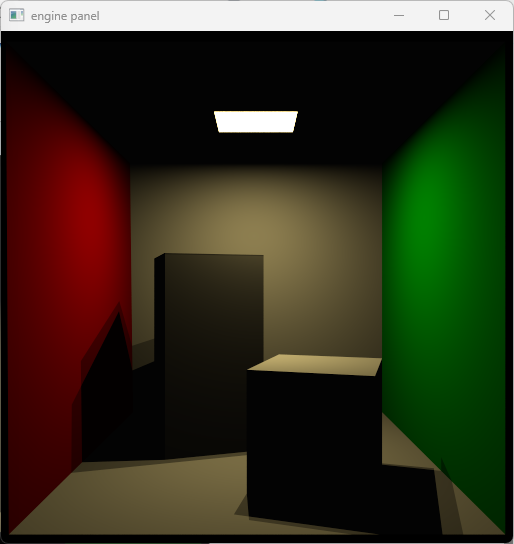
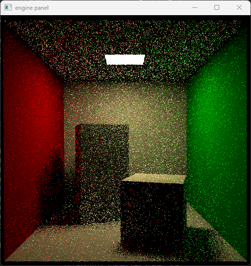

## Worksheet 7 - Progressive Path Tracing

I would say one of the most surprising parts of taking this course is how long it took for us to get to the "fun part". I am not saying that the previous exercises weren't necessarily fun, but I am saying there is a reason "Ray Tracing in One Weekend" rushes as fast as possible to get Monte Carlo working.

Ping Pong rendering ended up causing me to do one of the ugliest refactors of the code that I did, I will not go into too much detail but if you check out `render_state.rs` and notice a lot of duplication, this part was what created it.

The basic set up is that we need to hold two render textures:

```rs
pub struct RenderState {
    /* snip */
    render_source: RenderSource,
    render_destination: RenderDestination,
    /* snip */
}
```

These are then updated during the render pass:

```rs
    pub fn render(&self) -> Result<(), wgpu::SurfaceError> {
        /* snip, create the surface texture */

        /* snip, create command encoder */
        let source_view = self
            .render_source
            .texture
            .create_view(&wgpu::TextureViewDescriptor::default());
        let mut render_pass = encoder.begin_render_pass(&wgpu::RenderPassDescriptor {
            label: Some("Render Pass"),
            color_attachments: &[
                Some(wgpu::RenderPassColorAttachment {
                    /* snip, this is the surface texture */ 
                }),
                Some(wgpu::RenderPassColorAttachment {
                    view: &source_view, // source view
                    resolve_target: None,
                    ops: wgpu::Operations {
                        load: wgpu::LoadOp::Load,
                        store: true,
                    },
                }),
            ],
            /* snip */
        });

        /* snip, 
            set pipeline, 
            set vertex and index buffers, 
            set bind groups, 
            perform the render pass */ 

        encoder.copy_texture_to_texture(
            wgpu::ImageCopyTexture {
                texture: &self.render_source.texture,
                mip_level: 0,
                origin: wgpu::Origin3d::ZERO,
                aspect: wgpu::TextureAspect::All,
            },
            wgpu::ImageCopyTexture {
                texture: &self.render_destination.texture,
                mip_level: 0,
                origin: wgpu::Origin3d::ZERO,
                aspect: wgpu::TextureAspect::All,
            },
            self.render_source.texture.size(),
        );

        /* snip, order encoder to execute commands */ 
    }

```

There are further additions to the uniforms to pass the current frame number and screen size to the shader.

```rs
#[repr(C, align(16))]
#[derive(Debug, Copy, Clone, bytemuck::Pod, bytemuck::Zeroable)]
struct Uniform {
    /* snip */

    /// Which iteration this frame is for ping pong rendering
    iteration: u32,

    /* snip */

    /// resolution of the canvas for ping pong rendering
    /// and random seeding
    canvas_resolution: [u32; 2],
}
```

As well as changes to the UI and business logic that I will not cover here.

I also had to do some minor changes to the random functions to stop Naga from complaining:

```rs
// PRNG xorshift seed generator by NVIDIA
fn prng_xorshift_seed_generator(val0: u32, val1: u32) -> u32 {
      let N = 16u; // User specified number of iterations
      var v0: u32 = val0;
      var v1: u32 = val1;
      var s0: u32 = 0u;

      for(var n = 0u; n < N; n++) {
        s0 += 0x9e3779b9u;
        v0 += ((v1<<4u)+0xa341316cu)^(v1+s0)^((v1>>5u)+0xc8013ea4u);
        v1 += ((v0<<4u)+0xad90777du)^(v0+s0)^((v0>>5u)+0x7e95761eu);
      }

      return v0;
}

 // Generate random unsigned int in [0, 2^31)
 fn mcg31(prev: ptr<function, u32>) -> u32 {
    let LCG_A = 1977654935u; // Multiplier from Hui-Ching Tang [EJOR 2007]
    *prev = (LCG_A * (*prev)) & 0x7FFFFFFFu;
    return *prev;
}
// Generate random float in [0, 1)
fn rnd(prev: ptr<function, u32>) -> f32
{
    return f32(mcg31(prev)) / f32(0x80000000u);
}
```

### 1. Ping Pong Rendering

After those, we update the fragment shader to remove the subdivision:

```rs
@fragment
fn fs_main(in: VertexOutput) -> FragmentOutput {
    let bgcolor = vec4f(BACKGROUND_COLOR, 1.0);
    let max_depth = MAX_DEPTH;
    let uv = in.coords * 0.5;

    let coord_y: u32 = u32(in.clip_position.y);
    let coord_x: u32 = u32(in.clip_position.x);
    let res_x: u32 = uniforms.resolution.x;
    let launch_idx = coord_y*uniforms.resolution.x + coord_x;
    var t = prng_xorshift_seed_generator(launch_idx, uniforms.iteration);
    let jitter = vec2f(rnd(&t), rnd(&t))/f32(uniforms.resolution.y);
    
    var result = vec3f(0.0);
    // each loop is one bounce
    var r = get_camera_ray(uv, jitter);
    var hit = hit_record_init();
    for (var i = 0; i < max_depth; i++) {
        if (intersect_scene_bsp(&r, &hit)) {
            result += shade(&r, &hit);
        } else {
            result += bgcolor.rgb; break;
        }

        if (hit.has_hit) {
            break;
        }
    }
    
    let curr_sum = textureLoad(renderTexture, vec2u(in.clip_position.xy), 0).rgb*f32(uniforms.iteration);
    let accum_color = (result + curr_sum)/f32(uniforms.iteration + 1u);

    let output = FragmentOutput(
        vec4f(pow(accum_color, vec3f(1.5/1.0)), bgcolor.a),
        vec4f(accum_color, 1.0),
    );
    return output;
}
```

The only further changes needed is we now pass the jitter to the camera ray function.

With one sample:


Seems to be working and now we have progressive anti-aliasing.



### 2. Soft Shadows

For this section, we now have to pass our random state variable to our shade functions. For the lambertian here, I still ended up sampling every single area light although this is strictly speaking no longer necessary and we can just randomly sample an area light.

```rs
fn lambertian(r: ptr<function, Ray>, hit: ptr<function, HitRecord>, rand: ptr<function, u32>) -> vec3f { 
    /* snip */
    for (var idx = 1u; idx < light_tris; idx++) {
        let light = sample_area_light((*hit).position, idx, rand); // pass the rand

        /* snip */
    }
    /* snip */
}
```

The sample_area_light function changes too. We generate two random numbers and use these to generate barycentric coordinates.

```rs
fn sample_area_light(pos: vec3f, idx: u32, rand: ptr<function, u32>) -> Light {
    /* snip */

    let psi1 = sqrt(rnd(rand));
    let psi2 = rnd(rand);
    let alpha = 1.0 - psi1;
    let beta = (1.0 - psi2) * psi1;
    let gamma = psi2 * psi1;
    let normal = normalize(cross((v0 - v1), (v0 - v2)));

    let sampled_point = (v0 * alpha + v1 * beta + v2 * gamma);

    let light_direction = sampled_point - pos;
    /* snip */
}

```

With one sample, we clearly have done something.


And with many samples, we now have soft shadows.


### 3. Indirect Illumination

Alright, time to do global illumination. We already have everything we need on the CPU side, so we just need to write the shader. We need these two helper functions (already provided):

```rs
// Given a direction vector v sampled around the z-axis of a
// local coordinate system, this function applies the same
// rotation to v as is needed to rotate the z-axis to the
// actual direction n that v should have been sampled around
// [Frisvad, Journal of Graphics Tools 16, 2012;
//  Duff et al., Journal of Computer Graphics Techniques 6, 2017].
fn rotate_to_normal(normal: vec3f, v: vec3f) -> vec3f
{
    let signbit = sign(normal.z + 1.0e-16);
    let a = -1.0/(1.0 + abs(normal.z));
    let b = normal.x*normal.y*a;
    return vec3f(1.0 + normal.x*normal.x*a, b, -signbit*normal.x)*v.x
      + vec3f(signbit*b, signbit*(1.0 + normal.y*normal.y*a), -normal.y)*v.y
      + normal*v.z;
}

// Given spherical coordinates, where theta is the
// polar angle and phi is the azimuthal angle, this
// function returns the corresponding direction vector
fn spherical_direction(sin_theta: f32, cos_theta: f32, phi: f32) -> vec3f
{
    let sin_phi = sin(phi);
    let cos_phi = cos(phi);
    return vec3f(sin_theta*cos_phi, sin_theta*sin_phi, cos_theta);
}
```

Pretty disappointing to see trigonometric functions rear their ugly heads in graphics code, but I will have to let it slide for this time. The Lambertian will have to change completely now:

```rs
fn lambertian(r: ptr<function, Ray>, hit: ptr<function, HitRecord>, rand: ptr<function, u32>) -> vec3f {
    let material = get_material(hit);
    let brdf = material.diffuse.rgb / PI;
    let emission = material.ambient.rgb;
    var diffuse = vec3f(0.0);
    var ambient = vec3f(0.0);

    let normal = (*hit).normal;

    // Pick a random area light to sample
    let light_tris = arrayLength(&lightIndices) - 1u;
    let idx = (rnd_int(rand) % light_tris) + 1u; 
    // area lights start from index 1 due to how I create the bind group
    let light = sample_area_light((*hit).position, idx, rand);

    // Trace shadow rays to area light
    let ray_dir = light.w_i;
    let ray_orig = (*hit).position;
    var ray = ray_init(ray_dir, ray_orig);
    ray.tmax = light.dist - ETA;
    ray.tmin = ETA;

    var hit_info = hit_record_init();
    let blocked = intersect_trimesh(&ray, &hit_info);

    if (!blocked) {
        diffuse = brdf * vec3f(saturate(dot(normal, light.w_i))) * light.l_i * f32(light_tris);
    }  
    // Add emission only during direct lighting pass 
    if ((*hit).emit) { 
        ambient = emission;
    }

    // Scale diffuse and hit factor
    diffuse = diffuse * (*hit).factor;
    (*hit).factor *=  brdf * PI;
    // Russian Roulette to decide to trace more
    let prob_reflection = (brdf.r + brdf.g + brdf.b) / 3.0;
    let step = rnd(rand);
    if (step < prob_reflection) {
        setup_indirect(r, hit, rand);
        (*hit).factor /= prob_reflection;
    }

    return diffuse + ambient;
}
```

So, regardless of whether we do the direct light contribution or the indirect light contribution, we run the same function.

First we pick a random area light and sample it:

```rs
    // Pick a random area light to sample
    let light_tris = arrayLength(&lightIndices) - 1u;
    let idx = (rnd_int(rand) % light_tris) + 1u; 
    // area lights start from index 1 due to how I create the bind group
    let light = sample_area_light((*hit).position, idx, rand);
```

Then we trace shadow rays to the area light:

```rs
    // Trace shadow rays to area light
    let ray_dir = light.w_i;
    let ray_orig = (*hit).position;
    var ray = ray_init(ray_dir, ray_orig);
    ray.tmax = light.dist - ETA;
    ray.tmin = ETA;

    var hit_info = hit_record_init();
    let blocked = intersect_trimesh(&ray, &hit_info);

    if (!blocked) {
        diffuse = brdf * vec3f(saturate(dot(normal, light.w_i))) * light.l_i * f32(light_tris);
    }  
```

Originally, I forgot to create a new HitRecord struct for this which caused some hilarious results:


Here are areas where the lighting turned out negative painted magenta:


We check the emit flag and add ambient (emissive) contribution if it is set.

```rs
    // Add emission only during direct lighting pass 
    if ((*hit).emit) { 
        ambient = emission;
    }
```

We update the factor:

```rs
    // Scale diffuse and hit factor
    diffuse = diffuse * (*hit).factor;
    (*hit).factor *=  brdf * PI;
```

And finally perform Russian Roulette to decide whether to absorb or scatter:

```rs
    // Russian Roulette to decide to trace more
    let prob_reflection = (brdf.r + brdf.g + brdf.b) / 3.0;
    let step = rnd(rand);
    if (step < prob_reflection) {
        setup_indirect(r, hit, rand);
        (*hit).factor /= prob_reflection;
    }
```

If we decide to scatter, we sample two random numbers to decide on a direction, and we unset the emit flag so we do not add the emissive contribution for reflected rays:

```rs
fn setup_indirect(r: ptr<function, Ray>, hit: ptr<function, HitRecord>, rand: ptr<function, u32>) {
    // Indirect contribution
    let normal = normalize((*hit).normal);
    let xi1 = rnd(rand);
    let xi2 = rnd(rand);
    let thet = acos(sqrt(1.0-xi1));
    let phi = 2.0 * PI * xi2;
    let tang_dir = spherical_direction(sin(thet), cos(thet), phi);
    let indirect_dir = rotate_to_normal(normal, tang_dir);

    (*r).direction = indirect_dir;
    (*r).origin = (*hit).position;
    (*r).tmin = ETA;
    (*r).tmax = 5000.0;

    (*hit).has_hit = false; 
    (*hit).emit = false;
}
```

With one sample, it is clear that we are now doing a lot more:



And with many samples, it is very clear that the room is now being very well lit by the intense light source in the ceiling.


However, there is a lot of noise in the form of fireflies. A simple way to reduce noise is to introduce bias by limiting the maximum contribution of a path.

```rs
    result += min(shade(&r, &hit, &t), firefly_clamp);
```

Blender cycles uses a default clamp of 10.0, let's try it:


This still needs denoising to look the best but the fireflies have disappeared.

I have also tried a much more extreme clamp of 1.0:


The noise is significantly reduced but the "bloomy" warm look of the image is also mostly gone.


