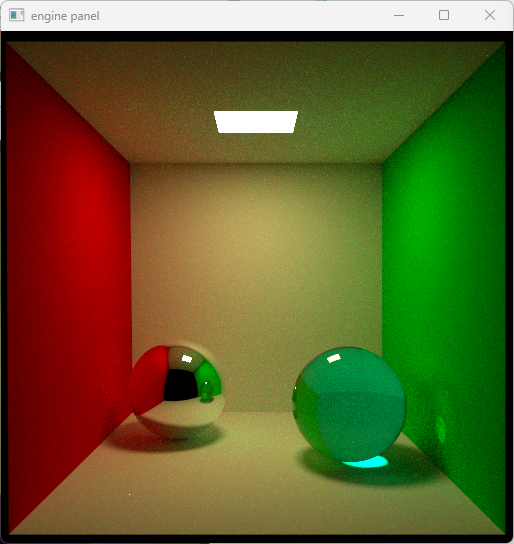

## Worksheet 8 - Transparency

### 1. Fresnel reflectance

To do specular reflections initially, we used the Phong model. The Phong model is popular in real time graphics (well, technically Blinn-Phong is although it is almost identical to Phong) because it creates an acceptable result in many materials very cheaply. However, let's take a look at our Phong reflection one more time.


That is not quite right. First of all, our light source has a square shape but our specular reflection is an oval. Also something about the glass sphere just looks off, it doesn't look like it belongs in the scene. Time to add a better model.

We need the Fresnel equations this time:

```rs
fn fresnel_r(cos_thet_i: f32, cos_thet_t: f32, ni_over_nt: f32) -> f32 {
    let ii = ni_over_nt * cos_thet_i;
    let tt = 1.0 * cos_thet_t;
    let ti = 1.0 * cos_thet_i;
    let it = ni_over_nt * cos_thet_t;

    let r1 = (ii - tt) / (ii + tt);
    let r2 = (ti - it) / (ti + it);
    let R = 0.5 * (r1 * r1 + r2 * r2);
    return R;
}
```

We only keep track of relative indices of refraction in our path tracer but as it turns out, if we set one value to 1.0, the equations still work.

```rs
fn transparent(r: ptr<function, Ray>, hit: ptr<function, HitRecord>, rand: ptr<function, u32>) -> vec3f {
    let w_i = -normalize((*r).direction);
    let normal = normalize((*hit).normal);
    var out_normal = vec3f(0.0);
    var ior = (*hit).ior1_over_ior2;
    // figure out if we are inside or outside
    var cos_thet_i = dot(w_i, normal);
    // normals point outward, so if this is positive
    // we are inside the object
    // and if this is negative, we are outside
    if (cos_thet_i < 0.0) {
        // outside
        cos_thet_i = dot(w_i, -normal); 
        out_normal = -normal;
    } else {
        // inside
        ior = 1.0 / ior;
        out_normal = normal;
    }

    let cos_thet_t_2 = (1.0 - (ior*ior) * (1.0 - cos_thet_i * cos_thet_i));
    var reflection_prob = 0.0;
    if (cos_thet_t_2 < 0.0) {
        // total internal reflection
        reflection_prob = 1.0;
    } else {
        reflection_prob = fresnel_r(cos_thet_i, sqrt(cos_thet_t_2), ior);
    }
    let tangent = out_normal * cos_thet_i - w_i;
    
    let w_t = ior * tangent - (out_normal * sqrt(cos_thet_t_2));
    let orig = (*hit).position;

    *r = ray_init(w_t, orig); 
    (*hit).has_hit = false;
    
    let step = rnd(rand);
    if (step < reflection_prob) {
        (*hit).normal = out_normal;
        return mirror(r, hit, rand);
    } else {
        return vec3f(0.0);
    }
}
```

The transparent shader is much like the transmit shader, however we now use the fresnel equations to sample reflection events. A reflection is just the mirror shader.

With one sample, it is not obvious that we solved the issue:


But as it turns out, we converge quickly:


Something is a bit off however, the edges of the transmitting sphere should be a bit brighter.

### 2. Indirect illumination

In this part, we now have to add back indirect lighting.

```rs
fn mirror(r: ptr<function, Ray>, hit: ptr<function, HitRecord>, rand: ptr<function, u32>) -> vec3f { 
    /* snip */ 

    (*hit).emit = true;
    return vec3f(0.0, 0.0, 0.0);
}

fn transparent(r: ptr<function, Ray>, hit: ptr<function, HitRecord>, rand: ptr<function, u32>) -> vec3f {
    /* snip */

    (*hit).emit = true; // change

    let step = rnd(rand);
    if (step < reflection_prob) {
        (*hit).normal = out_normal;
        return mirror(r, hit, rand);
    } else {
        return vec3f(0.0);
    }
}

```

Not a whole lot changes besides having to set the emit flag in a few more places. With one sample:


And with many samples:


The image is once again off at the edges of the transmitting sphere.

### 3. Absorption

For absorption, we need to modify the transmit shader again. To make it more clear what the code is doing, I split it into two large branches, one for entering and one for exiting the object. When entering, the only possible events are reflection and transmission (refraction). When exiting, we can have internal reflection, transmission, or absorption. 

```rs
fn transparent(r: ptr<function, Ray>, hit: ptr<function, HitRecord>, rand: ptr<function, u32>) -> vec3f {
    let w_i = -normalize((*r).direction);
    let normal = normalize((*hit).normal);
    var out_normal = vec3f(0.0);
    var ior = (*hit).ior1_over_ior2;
    // figure out if we are inside or outside
    var cos_thet_i = dot(w_i, normal);
    // normals point outward, so if this is positive
    // we are inside the object
    // and if this is negative, we are outside
    var absorption = 0.0;
    var T_r = vec3f(1.0);
    if (cos_thet_i < 0.0) {
        // entering

        /* snip 
           same as the previous section
        */
    } else {
        // exiting
        ior = 1.0 / ior;
        out_normal = normal;
        let s = length((*hit).position - (*r).origin) / 100.0;
        let rho_t = (*hit).extinction;
        T_r = exp(-rho_t*s);
        let transmission_prob = (T_r.r + T_r.g + T_r.b) / 3.0;
        if (transmission_prob < 0.0 || transmission_prob > 1.0) {
            return error_shader();
        }

        /* snip 
           reflection calculations
        */

        (*hit).has_hit = false;
        (*hit).emit = true;

        let step = rnd(rand);
        if (step < reflection_prob) {
            // reflection
            (*hit).normal = out_normal;
            return mirror(r, hit, rand);
        }
        else if (step < reflection_prob + transmission_prob) {
            // transmission
            (*hit).factor = (*hit).factor * T_r / (reflection_prob + transmission_prob);
            return vec3f(0.0);
        }
        // absorption
        (*hit).has_hit = true;
        return vec3f(0.0);
    }
}
```

When using certain extinction values, the results can be quite convincing:


However, I do not think that I did this part correctly, there is likely somewhere I forgot a scaling factor. I will use another example for this.



The area underneath the sphere here is way too bright, it is so bright that it actually has a bright reflection on the wall. When I use low extinction values (not in the hundreds), I get a rather bright spot under the sphere but a heavily tinted sphere still. This makes sense to me since our scale is in centimeters and the extinction coefficient isn't really meant to be between 0 and 1 as far as I can understand, so this might make sense, but I might also be missing something.

Here is also what a single sample looks like:


