## Worksheet 9 - Environment Mapping

To support environment mapping, we need to extend the rendering framework to support multiple textures. That I did. What I forgot to do was also abstract away being able to set textures to sRGB or linear. Oops. I am sure linear textures look fine on worksheet 3, right?

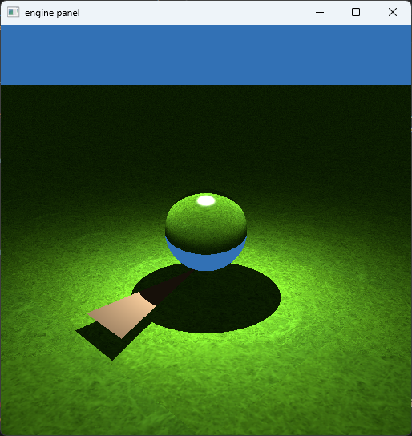

Nevertheless, for part 1, I used an sRGB texture, and for part 2 and 3, I used linear. 

### 1. SDR Pixar Campus

This part is relatively straightforward. We just need a function to convert a direction to a sample in the environment map.

```rs
fn environment_map(direction: vec3f) -> vec3f {
    let d_x = direction.x;
    let d_y = direction.y;
    let d_z = direction.z;
    let u = 0.5 * (1.0 + (1.0 / PI) * atan2(d_x, -d_z)); // atan instead of atan2 breaks this
    let v = 1.0 / PI * acos(-d_y);
    return textureSample(hdri0, hdri0_sampler, vec2f(u, 1.0 - v)).rgb;
}
```

I was mildly irritated when I used `atan` instead of `atan2` and had one side of the scene mirrored and inverted on the other side and did not know what was wrong.

We also no longer have a direct contribution in the lambertian, so that can also go:

```rs
fn lambertian(r: ptr<function, Ray>, hit: ptr<function, HitRecord>, rand: ptr<function, u32>) -> vec3f {
    /* snip */

    // There is no direct light source, so just create a dummy light
    let light = light_init();

    /* snip */
}
```

We then call it when our rays miss, and we are done:

```rs
    for (var i = 0; i < max_depth; i++) {
        if (intersect_scene_bsp(&r, &hit)) {
            result += shade(&r, &hit, &t);
        } else {
            result += environment_map(r.direction) * hit.factor; // new
            break;
        }

        if (hit.has_hit) {
            break;
        }
    }
```

Base color looks just fine:

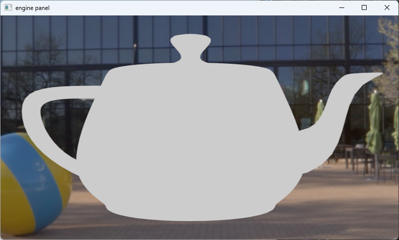

And so does the mirror:

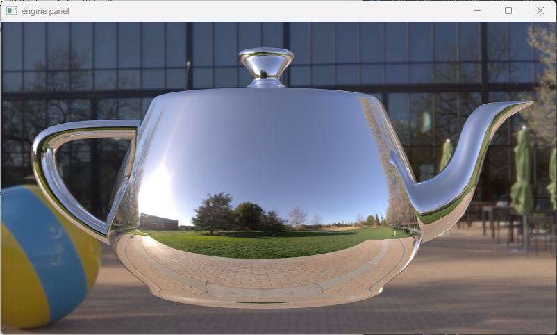

And the lambertian:

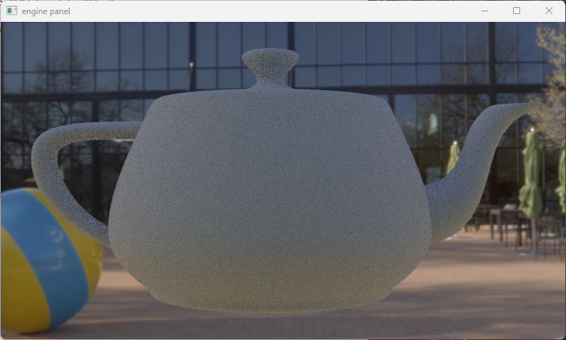

Wait no, that is not right at all. Well, the render is correct but an sRGB environment map cannot create physically correct lighting for lambertian materials.

I have also taken images of the bunny:

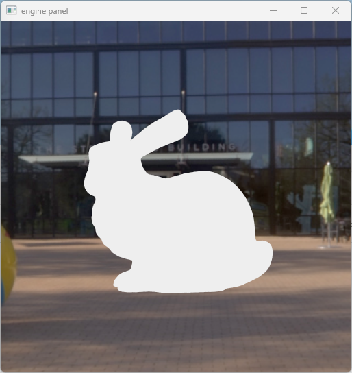

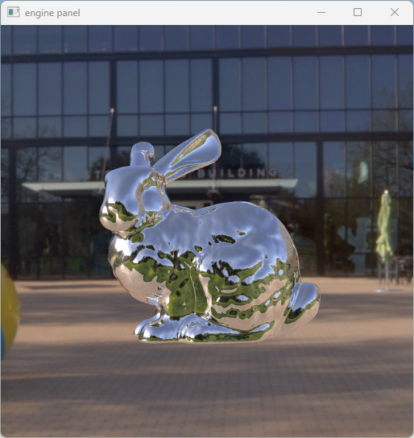

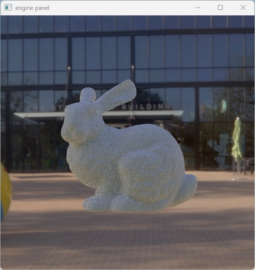

### 2. HDR Pixar Campus

In this part we are using the high dynamic range version of the same environment map in png format where the alpha channel contains an exponent for the brightness of a particular pixel. So our mapping function is modified:

```rs
fn environment_map(direction: vec3f) -> vec3f {
    let d_x = direction.x;
    let d_y = direction.y;
    let d_z = direction.z;
    let u = 0.5 * (1.0 + (1.0 / PI) * atan2(d_x, -d_z));
    let v = 1.0 / PI * acos(-d_y);

    let sample = textureSample(hdri0, hdri0_sampler, vec2f(u, 1.0 - v));
    var color = sample.rgb;
    let exponent = sample.a * 255.0 - 128.0;
    color = color * pow(2.0, f32(exponent));
    return color;
}
```

We are not done yet, we also want simulated AO with the ground plane.

For that we create a holdout shader:

```rs
fn holdout_shader(r: ptr<function, Ray>, hit: ptr<function, HitRecord>, rand: ptr<function, u32>) -> vec3f {
    let normal = normalize((*hit).normal);
    let xi1 = rnd(rand);
    let xi2 = rnd(rand);
    let thet = acos(sqrt(1.0-xi1));
    let phi = 2.0 * PI * xi2;
    let tang_dir = spherical_direction(sin(thet), cos(thet), phi);
    let direct_dir = rotate_to_normal(normal, tang_dir);

    var ray = ray_init(direct_dir, (*hit).position);
    ray.tmin = ETA;
    ray.tmax = 5000.0;
    
    var hit_info = hit_record_init();
    let blocked = intersect_trimesh_immediate_return(&ray, &hit_info);

    // if blocked, return zero contribution (AO)
    if (blocked) {
        return vec3f(0.0);
    }

    // else just return the environment map
    (*hit).has_hit = true;
    return environment_map((*r).direction) * (*hit).factor;
}
```

This makes it so that any ray reflected from our object to the ground plane samples a random direction and if the ray hits our object again, we return a zero contribution. This adds a subtle shadow at the bottom of our kettle.

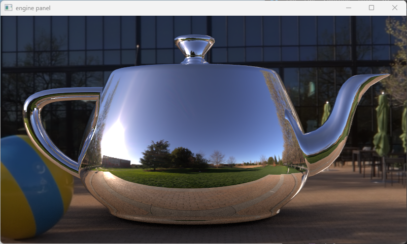

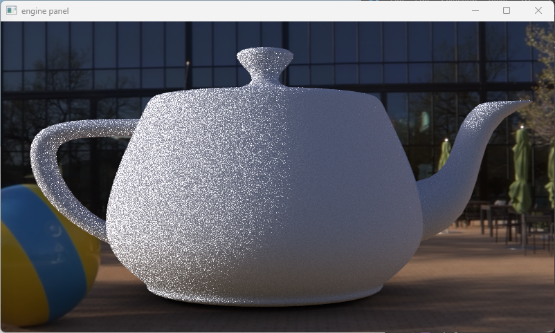

Although the mirror looks good, the lambertian is quite noisy. Without importance sampling, this scene will take a pretty long time to converge since the sun is a tiny part of the sky we are pretty unlikely to hit.

Bonus picture where I switched the shader midway through the render:

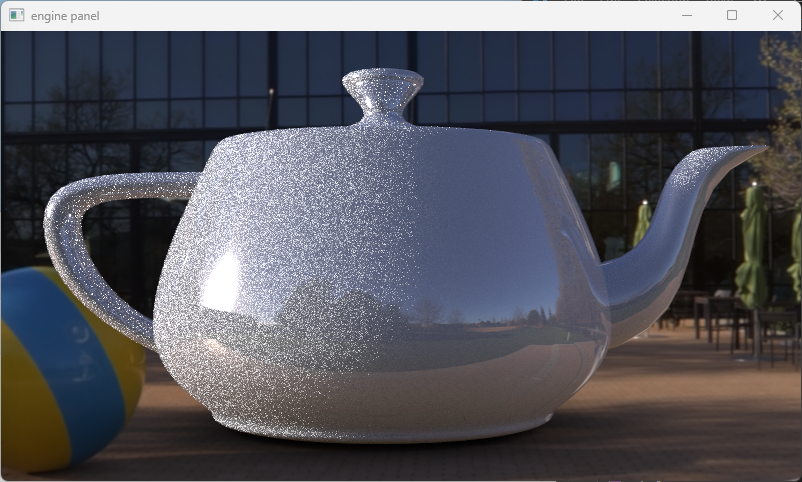

I have also taken pictures of the bunny, however the bunny is floating and I did not update the position of the ground plane:

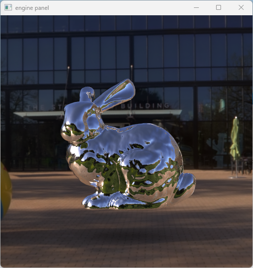

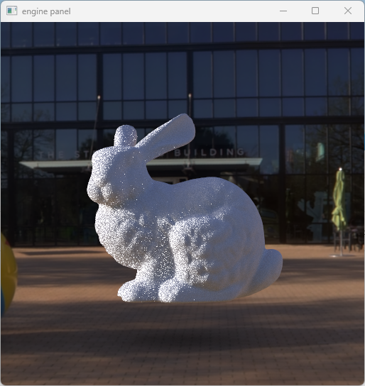

### 3. Directional Light

Time for some more fakery. I have been provided the approximate direction of the sun thanks to some friends.

```rs
const SUN_DIRECTION = vec3f(1.0, -0.35, 0.0);
```

And now we can add fake hard shadows using the following:

```rs
fn sample_directional_light() -> Light {
    let light_intensity = vec3f(10.0);
    let light_direction = -normalize(SUN_DIRECTION);

    var light = light_init();
    light.l_i = light_intensity;
    light.w_i = light_direction;
    light.dist = 999999.0;

    return light;
}
```

We add the direct light contribution to the lambertian shader again:

```rs
fn lambertian(r: ptr<function, Ray>, hit: ptr<function, HitRecord>, rand: ptr<function, u32>) -> vec3f {
    /* snip */

    // Get the sun
    let light = sample_directional_light();

    /* snip */
}
```

And finally update the holdout shader to return different values based on whether we hit the direct and indirect shadow rays:

```rs
fn holdout_shader(r: ptr<function, Ray>, hit: ptr<function, HitRecord>, rand: ptr<function, u32>) -> vec3f {
    var contribution = 1.0;
    
    let normal = normalize((*hit).normal);
    let xi1 = rnd(rand);
    let xi2 = rnd(rand);
    let thet = acos(sqrt(1.0-xi1));
    let phi = 2.0 * PI * xi2;
    let tang_dir = spherical_direction(sin(thet), cos(thet), phi);
    let direct_dir = rotate_to_normal(normal, tang_dir);
    let color = environment_map((*r).direction) * (*hit).factor;

    // AO contribution
    var hit_info = hit_record_init();
    var ray = ray_init(direct_dir, (*hit).position);
    if (intersect_scene_bsp(&ray, &hit_info)) {
        contribution -= 0.5;
    }

    // sun contribution
    let light = sample_directional_light();
    ray = ray_init(light.w_i, (*hit).position);
    if (intersect_scene_bsp(&ray, &hit_info)) {
        contribution -= 0.5;
    }  

    (*hit).has_hit = true;
    return color * contribution;
}
```

We can now see a direct shadow and the whole shadow on the mirror.

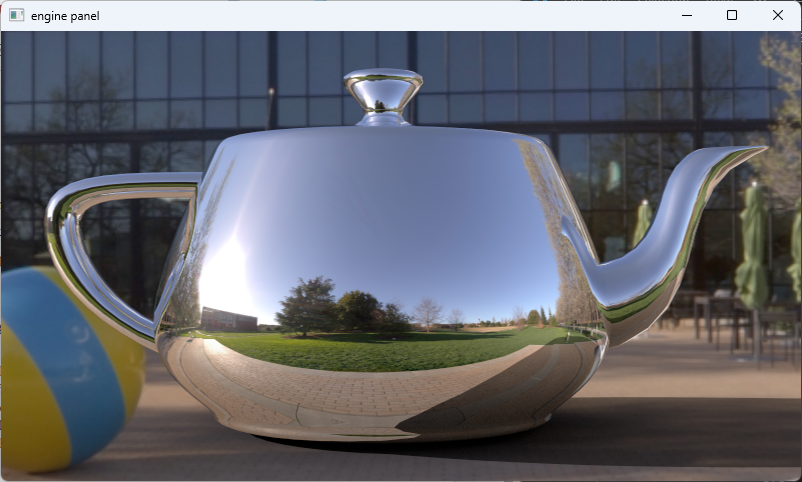

And the lambertian:

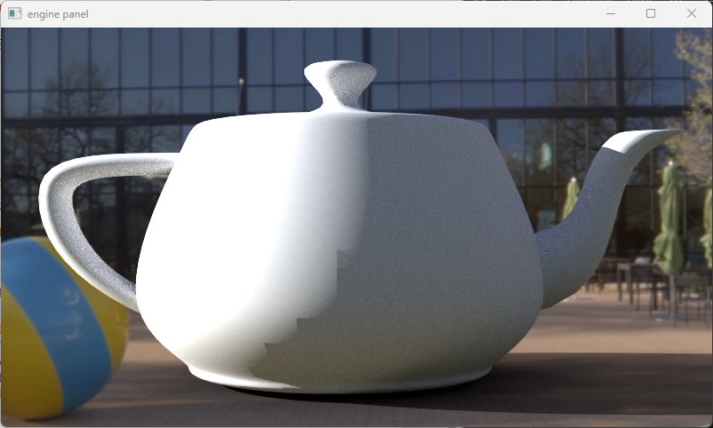

The triangle intersection function has become the bane of my existence.

I made a small edit:

```rs
    if (abs(denom) < 0.00005 || denom > 0.0) {
        return false;
    }
```


Looks pretty much perfect!

### 4. Another HDRI

I did not do this part, sorry.